# Labo découverte Maltego

## Introduction

Maltego est un outil de data mining capable d'explorer une variété de ressources de données open-source et utilise ces données pour créer des graphs permettant d'analyser des éventuelles connexions identifiées entre ces différentes ressources.

Les graphs permettent de faire des connexions entre des informations comme le nom d'une organisation, les adresse email et son structure organisationnelle, des domaines, des documents, etc.

Maltego est écrit en Java, ce qui lui permet de fonctionner sur Windows, Mac et Linux. Il est pré-installé sur Kali.

Dans la pratique, Maltego recherche et parse des grandes quantités d'information à partir de sites publiques et produit un jolie graph pour vous aider à rassembler les pièces du puzzle.

Maltego peut être utilisé en tout moment pendant un audit. Pourtant, si la cible est un domaine, c'est raisonnable de mapper le réseau depuis le début avec Maltego.

## Téléchargement et installation

Il y a plusieurs version de Maltego :

- Maltego XL : version premium pour de grandes quantités de données
- Maltego Classic : version payante qui inclut toutes les "transformations"
- Maltego CE (Community Edition) : Version gratuite avec des "transformations" limitées
- Casefile : pour examiner des liens sur des données offline

Nous allons travailler avec la version gratuite, Maltego CE.

### Installation

- Kali : comme déjà mentionné, Maltego est déjà pré-installé sur Kali. Vous aurez quand-même besoin de vous rendre sur le [site de Maltego](https://www.maltego.com/ce-registration/) pour créer un compte CE. Une fois votre compte crée, vous recevrez une clé qui vous permettra d'utiliser la Community Edition.
- Téléchargement : si vous installez Maltego sur votre machine Windows, Mac ou autre version de Linux, vous pouvez le [télécharger ici](https://www.maltego.com/downloads/). Il vous faudra le [compte CE](https://www.maltego.com/ce-registration/) aussi pour cette version. 

## Transforms

Maltego utilise des API pour connecter à d'autres applications et services. Maltego appelle ces connexions "Transforms" (transformations). 

Vous remarquerez qu'avec la version CE, certaines transformations sont gratuites et d'autres sont payantes. En plus, seul un petit groupe de transformations sont pré-installées. Il faudra donc dans certains cas s'enregistrer sur chaque site pour obtenir un accès à l'API de la transformation et l'activer. Ça dépendra de vos besoins.

Quelques transformations sont gratuites mais elles ne peuvent pas être installées sur la version gratuite de Maltego.

Nous pouvons commencer à travailler utilisant la config de base. La transformation Paterva CTAS CE est pré installée et elle fourni pas mal de fonctionnalités. On va rajouter quelques transforms intéressantes plus tard. 

## Une simple reconnaissance de réseau

En partant d'un nom de domaine, on peut commencer à mapper la structure d'une organisation. C'est assez surprenant la quantité d'information qui peut être disponible à partir de rien d'autre qu'un nom de domaine.

Cliquer sur le bouton **new graph** en haut, à gauche pour commencer un nouveau projet vide.

Depuis la palette d'entités (**Entity Palette**) à gauche, défilez vers le bas et trouvez l'entité **Domain**. Puis, faites-la glisser dans votre graph vierge. 

**Double-cliquez** sur l'icon **Domain** et changez le nom au domaine que vous voulez rechercher. Dans mon cas, j'ai choisi *heig-vd.ch*. Vous pouvez utiliser, par exemple, le domaine de l'entreprise que vous avez audité en AST, si vous avez suivi le cours. Sinon, sentez-vous libre de choisir un domaine qui vous paraît intéressant.

Un click droit sur l'icône Domain ouvre la fenêtre d'execution de transformations, la **Run Transforms** box. On peut être assez spécifique ici et sélectionner seulement ce qui nous intéresse. Pourtant, nous allons devenir fous et simplement choisir **Run All Transforms** on sélectionnant la petite icône "fast forward" à côté. 

Dès que **Run Transform** est sélectionné, Maltego commence son travail en traçant la structure du réseau. **Remarque :** sur le côté gauche de l'interface du graphique, il existe plusieurs options pour visualiser le graphique sous différentes formes.

Vous pouvez voir dans les images ci-dessous que toutes sortes d'informations apparaissent, y compris les serveurs DNS, intranet, les sites qui peuvent avoir une certaine relation avec la cible, les emails associés, les serveurs de messagerie. Qu'est-ce que vous trouvez pour votre cas ? Faites des captures d'écran pour votre rendu et ajoutez vos commentaires !

#############################################################################

### Cas CleanGreen.ch

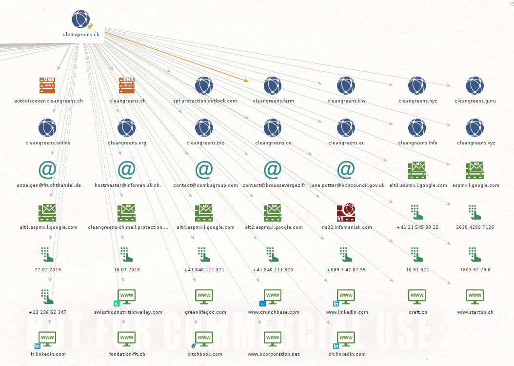

Voici les différentes informations que je trouve en cherchant l'entreprise CleanGreens SA. On trouve plusieurs URL non interessants d'autres pays et/ou d'autres entreprises. Nous avons par contre "cleangreens.guru", qui est l'application web fournie par l'entreprise. 

On a leur hébérgeur Infomaniak. On peut aussi constater qu'ils utilisent outlook comme outil de messagerie. On a quelques adresses, mais la plupart ne sont pas intéressantes, il y en a une qui finit en combagroup.com qui est en fait l'ancien nom de l'entreprise (CombaGroup SA). J'ai également quelques URL où les entreprises sont nomées qui ne sont pas vraiment interessant. On pourra cependant obtenir beaucoup d'informations sur les employés grâce à  linkedin.

Il y a plusieurs numéros de téléphone. Dont pas mal qui ne sont pas intéressants mais j'ai trouvé par exemple le +41 21 545 99 25 de la responsable qualité et sécurité alimentaire.

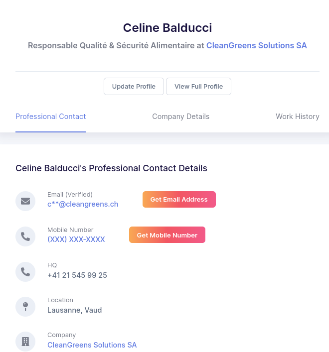]

Nous allons alors chercher plus d'informations à son sujet. 

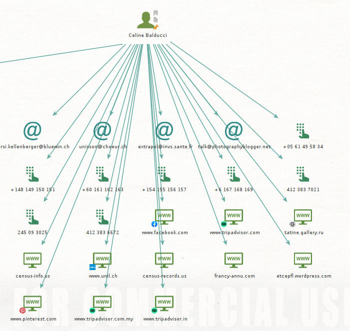

Les numéros de téléphone ne sont pas interessant, c'est juste des numéros de personne ayant le même nom de famille. On peut constaté qu'elle à fait l'unil et qu'elle aime voyager, le théatre (etcepfl) et la photographie. J'ai cherché un peu plus loin sur tripadvisor et j'ai trouvé son compte. J'ai pu voir qu'elle a voyagé en Grèce par exemple.

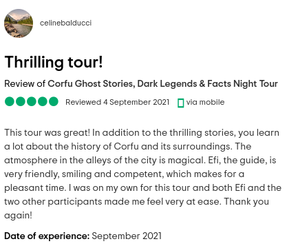

#############################################################################

On peut utiliser ces connexions pour en faire des nouvelles encore plus détaillées. Par exemple, des noms associés avec des emails et même des numéros de téléphone (les numéros de téléphone sont difficiles à obtenir en Europe. La recherche pour les USA fonctionne correctement).

Regardons de plus près une personne qui apparaît comme étant connectée au domaine heig-vd.ch. Il s'agit de "Bastian Gardel". Je fais clique-droit sur l'icône de Bastien et **run All Transforms**. De votre côté, sélectionnez une identité trouvée pour votre domaine et exécutez vos transformations. N'oubliez pas de faire une capture et commenter. 

Lorsque les transformations seront terminées, nous aurons un graphique supplémentaire de quelques adresses email associées à Bastien Gardel. On y trouve aussi une clé PGP qui lui appartient, peut-être. J'ai vérifié avec Bastien et les adresses sont en effet des adresses email qu'il utilise ou il a utilisées. Dans certains cas, les résultats peuvent être assez étranges.

N'hésitez pas à tester d'autres domaines.

## Recherche d'une identité

Si vous avez déjà une identité d'une personne que vous voulez rechercher, vous pouvez procéder directement avec Maltego. Commencez avec un nouveau graphique et rajoutez une personne avec l'entité Person. 

Je change l'identité de la personne en double cliquant sur l'icône et en introduisant mon nom.

Ensuite, j'execute toutes les transformations sur la personne comme on l'a déjà fait pour les éléments du domaine.

Dans mon cas, je trouve mon adresse email de la HEIG-VD et l'une de mes adresses prives.

Faites quelques recherches, avec des noms que vous connaissez (vous-même y-compris). Est-ce que vous arrivez à trouver des adresses email associées ? N'oubliez pas vos captures et commentaires.

#############################################################################

J'ai commencé par me tester moi-même. 

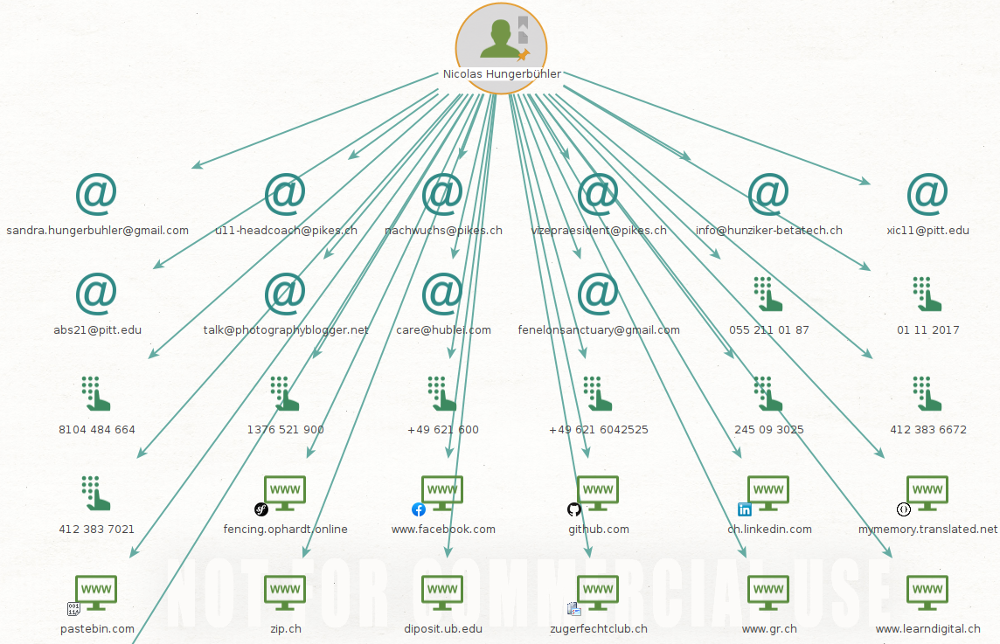

Aucune de mes adresses email n'apparaît, et l'adresse Sandrine n'est pas de ma famille. Les numéros de téléphone également ne sont pas les miens. Mise à part certaines informations sur mon passé d'escrimeur  (fencing.ophardt, zugerfechtclub), il n'y a rien de spécial à mon sujet. 

J'ai voulu regardé si ça marchait pour les pseudonymes. J'ai utilisé l'entité personne également, car Alias ne me donnait pas d'informations. 

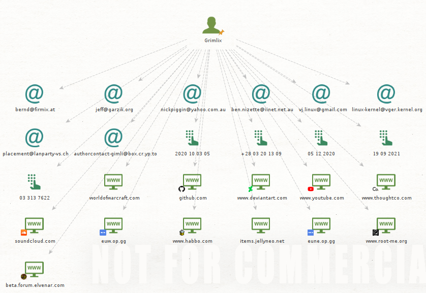

On peut trouver plusieurs de mes comptes qui existent vraiment, même certains trucs assez vieux. Très interessant si on arrive à obtenir le pseudonyme d'une cible car on va pouvoir trouver encore plus d'informations. Il n'y a toujours pas d'adresse email m'appartenant. Cependant l'adresse polylan montre que j'y ai participé.

J'ai testé pleins d'autres personnes de mon entourage (famille, amis) et aucun résultat ne me donne leur adresse email.

#############################################################################

## Recherche d'une adresse email

Si vous n'avez pas le nom d'une personne, mais une adresse email, vous pouvez aussi commencer votre recherche directement par l'adresse en question. Dans ce cas là, le résultat de la recherche pourrait vous trouver l'identité associée à cette adresse ainsi que d'autres détails comme, par exemple, une organisation, un numéro de téléphone, etc.

Pour chercher une adresse email, il suffit d'utiliser l'entité **Email Address** dans la palette.

Réalisez des recherches avec quelques adresses que vous connaissez, de préférence liées à une organisation. Est-ce que ça vous permet de retrouver des liens intéressants avec l'organisation ? Qu'avez-vous retrouvé en plus ? Accompagnez vos réponses avec des captures d'écran et commentaires.

#############################################################################

J'ai repris la personne qu'on a trouvé auparavant et j'ai testé son email.

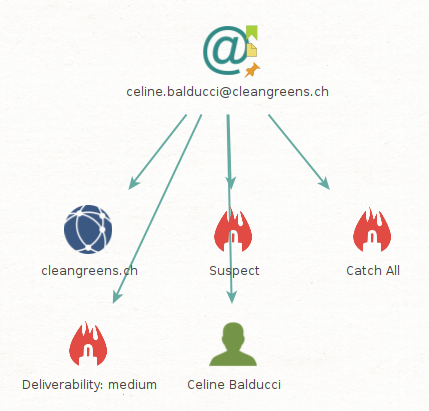

Nous n'obtenons pas plus d'informations en lien avec l'organisation. Cela nous donnes juste l'entité de l'organisation que nous avons testé avant. Si je test avec d'autres personnes c'est le même resultat, par exemple avec Abraham Rubinstein.

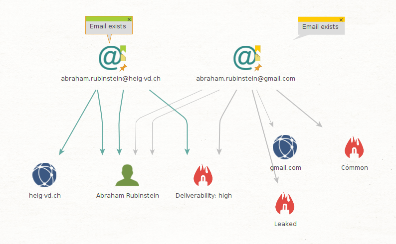

#############################################################################

## Installation et utilisation de nouvelles transformations

Pour installer de nouvelles transforms, cliquez sur l'onglet "Transforms" et ensuite sur Transform Hub. Depuis le hub, vous pouvez installer de nouvelles transformations.

Commençons par VirusTotal Public API. VirusTotal peut analyser des fichiers et des URLs pour chercher des malwares. Cela permet, par exemple, de trouver des fichiers/URLs compromis chez une cible. Vous aurez besoin de [créer un compte]( https://www.virustotal.com/gui/join-us) pour avoir accès à une clé vous permettant d'utiliser l'API et donc, la transformation correspondante pour Maltego. Un lien pour trouver votre clé vous sera envoyé dans le même email utilisé pour l'activation du compte.

#############################################################################

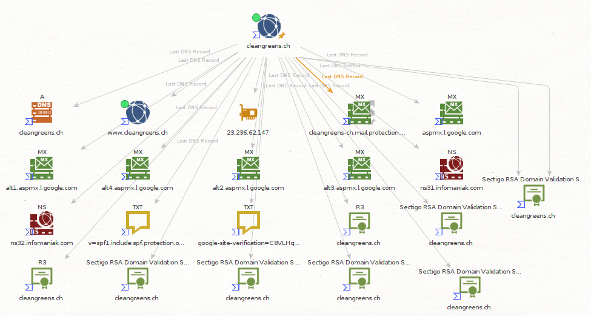

Nous obtenons pas mal d'informations en plus. Par exemple sur les certificats SSL avec l'émetteur du certificat (Sectigo p.e) et d'autres informations sur ceux-ci comme le SKI (Subject key Identifier) et AKI (Authority key identifier). 
On a un fichier google-site-verification qui nous amène sur un site qui analyse la valeur de l'entreprise. On y voit le DNS records qui peut être interessant et des informations sur le serveur.
Il y a un autre fichier text avec **v=spf1 include:spf.protection.outlook.com -all**, ce qui nous montre qu'ils utilisent un authentification par mail avec Office 365. 

#############################################################################

On va maintenant installer la Shodan Tranform. Shodan.io est un "analyseur d'Internet". Il donne des informations intéressantes (aussi de point de vue de la sécurité) sur des dispositifs connectés, des serveurs et services, etc. Pour comprendre ce que Shodan vous apporte à travers le Transform Maltego et comment ça marche, [vous pouvez lire cet article](http://maltego.blogspot.com/2016/04/abracadabra-its-shodan-time.html). Vous aurez besoin de [créer un compte](https://account.shodan.io/register) pour utiliser la transformation.

#############################################################################

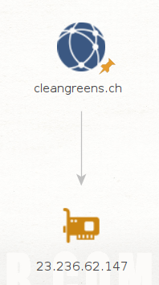

Nous avons seulement récupéré l'adresse IPv4 qu'on a déjà dans les deux autres transformations. Après quelque recherche on constate que c'est l'adresse IP de l'hôte :

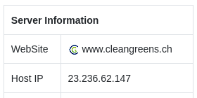

#############################################################################

PassiveTotal est une plateforme de recherche de menaces. Le but est de contribuer à analyser la sécurité de systèmes pour prévenir les attaques avant qu'elles n 'arrivent. Pour activer cette transformation, il faut commencer par la [création d'un compte](https://community.riskiq.com/registration). Vous accédez ensuite à votre espace utilisateur (account) et révélez les valeurs cachées dans API ACCESS. Attention, la transformation vous demande un user et une clé (key). Ces deux valeurs correspondent respectivement à votre adresse email et à la valeur identifiée comme "secret" sur votre compte riskiq. Pour plus d'information sur cette transformation, ce référer à [cet article](https://blog.passivetotal.org/brand-new-maltego-transforms-and-code/).

#############################################################################

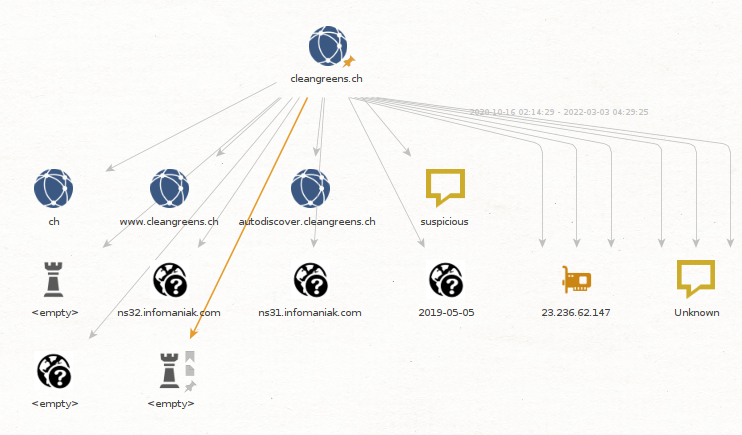

On a des fichiers textes inutiles en plus car ils ne nous disent rien de précis, après peux-être qu'il y a quelque chose de suspicieux a chercher. 

**autodiscover.cleangreens.ch** nous donne la plage reseau :

Et sinon on a quelques recherches WHOIS qui nous donnes des résultats vides.

#############################################################################

Vous pouvez chercher vous même des informations sur d'autres transformations disponibles.

Procédez maintenant à relancer les recherches que vous avez déjà effectuées, mais utilisant exclusivement les transformations que vous venez d'installer. Est-ce que vous arrivez à trouver d'autres informations ? N'oubliez pas votre capture et commentaires.

## Et maintenant ?

Est-ce qu'il vous restent encore des transforms gratuites à installer ? Vous pouvez donc procéder à l'installation d'autres transformations intéressantes comme Have I Been Pwned?, dataprovider, Farsight DNSB, FullContact, etc. Avoir un plus grand nombre de transformations installés augmente considérablement les résultats. Par contre, le volume d'information peut être difficile à gérer et à comprendre. Vous pouvez dans tous le cas, appliquer les transformations une par une au lieu de toutes en même temps.

Faites une petite recherche sur Internet pour comprendre le type d'information que chaque transformation vous apporte (ce n'est pas toujours très clair...). Remplissez un petit tableau avec ces informations. Ça peut devenir utile quand vous avez beaucoup de transformations installées.

| Transformers          | Description                                                  |
| --------------------- | ------------------------------------------------------------ |
| Have I been Pwned ?   | Permet d'analyser si une cible a été compromis. Il est possible de trouver si des leaks de mots de passe/domaines ont été leaked |
| FullContact           | Prend une adresse mail ou un domaine et enrichit la recherche afin  de simplifier l'investigation. |
| Google Maps Geocoding | Convertit des empalcements (adresses, phrases, coordonnées) and des adresses standardisées. |
| IPinfo.io             | Permet d'enrichir une recherche sur une adresse IP, un domaine ou des informations ASN,... |
| Farsight DNSDB        | Une des plus grandes base de données de données passives DNS. |

Utilisez donc ces nouvelles transformations que vous avez installé.

Tous les résultats sur le graph sont utilisables pour lancer des nouvelles recherches. Un clique-droit sur les différentes icônes vous permet de lancer des transformations à partir de cette entité. Vous pouvez lancer des transformations sur des numéros de téléphone, des services, des adresses IP, des coordonnées, des documents, etc.

Utilisez quelques résultats retrouvés lors de vos recherches précédentes pour lancer des transformations sur d'autres entités de types différents à celles que vous avez déjà testé (Person, Domain, email). Est-ce que vous arrivez à trouver quelque chose d'intéressant ? Est-ce que le graph devient difficile à gérer ? Documentez vos activités avec des captures et des commentaires.

- **Have I Been pwned?**

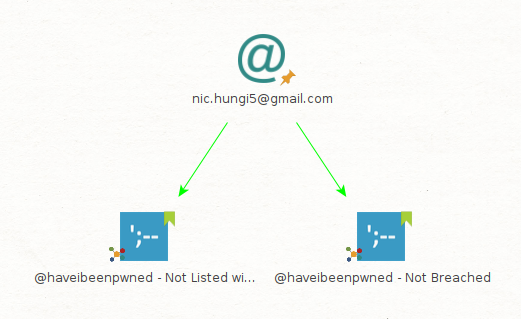

Mon adresse email est fonc safe.

- **FullContact**

  Je l'ai d'abord lancé avec mon adresse email, il ne trouve rien. Si je le lance avec un domaine on trouve que des resultats vides. J'ai essayé sur d'autres domaines précédemment trouvés mais j'obtient les mêmes résultats que ceux-ci :

  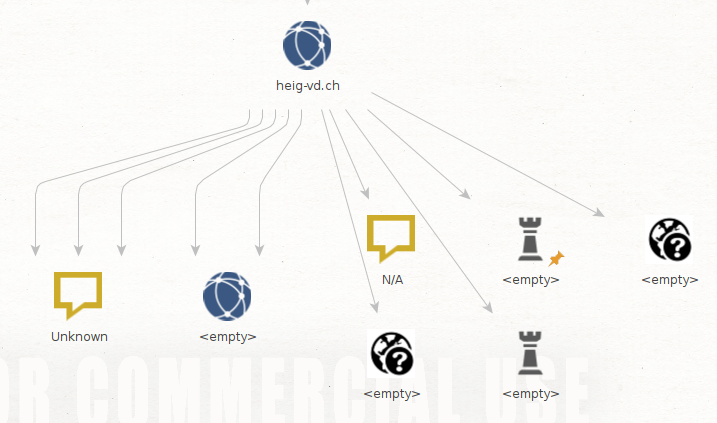

  J'ai également essayé sur d'autres domaines voire même un fichier trouvé aupravant et je ne trouve toujours que des entités vides :

  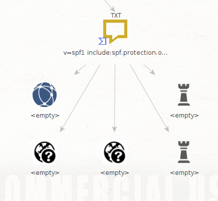

- **Googlemap**

  J'ai utilisé l'adresse trouvé de CleanGreens pour otbenir quelques informations en plus sur la location. Je ne trouve rien de très interessant, je pense qu'il est plus interessant de l'utiliser si nous avons un alias comme emplacement afin de découvrir d'où ça vient exactement.

  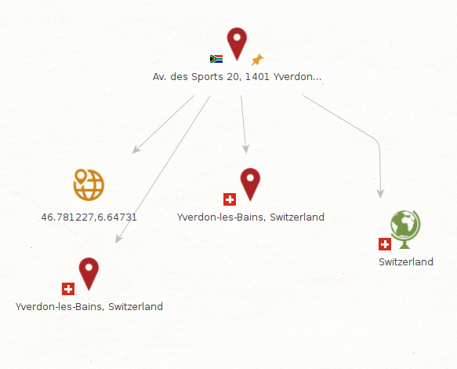

- **IPinfo.io**

  J'ai repris l'adresse IPv4 de cleangreens trouvée auparavant. On avait vu que c'était l'adresse IP de l'hôte et on peut trouver plus d'informations sur l'emplacement de cet hôte. Ils ont également un site internet ou on peut rechercher directement des informations sur une IP. 
  https://ipinfo.io/23.236.62.147

  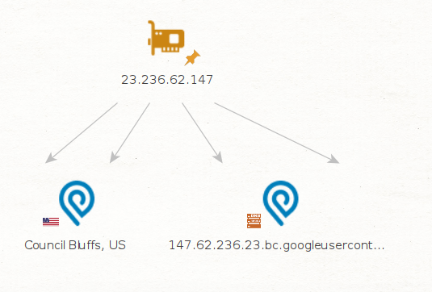

- **Farsight DNSDB**

  Nous avons utilisé le DNS de cleangreens afin de lancer ce transforms. On y retrouve les informations d'auparavant mais avec des records en plus.

  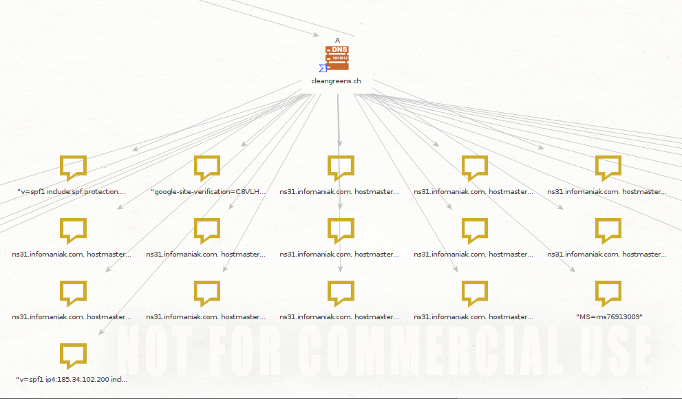

  Un fichier en plus a attiré mon intention c'est le MS=ms769130... que nous n'avions pas trouvé avant. Il se trouve dans le DNS record sur le site https://cleangreens.ch.siteindices.com/. 

​	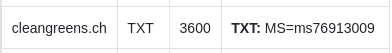

​	On peut donc en conclure que ce transform est plus détaillé (sur les DNS) qu'une recherche avec les 	    	transforms de base.

Au final, si on fait des scans en continue sur les résultats des autres scans on se retrouve avec un graphique illisible surtout quand il commence a avoir des liens de partout et on s'y perd. Déjà moi qui est supprimé des parties, je me retrouve avec un graphique comme ceci :

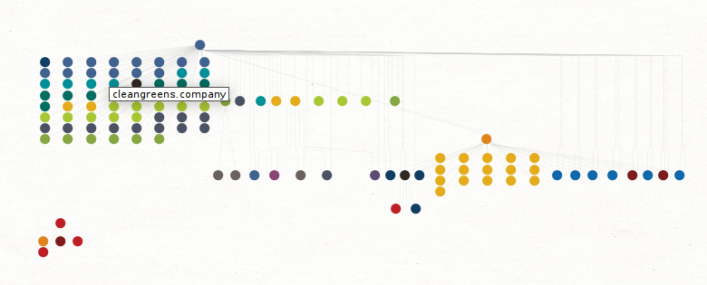

Je pense que la meilleure manière de faire c'est de séparer en plusieurs graphes certains scans. 

[GitHub est aussi une source précieuse de transformations](https://github.com/search?q=maltego+transform) qui ne se trouvent pas dans le Hub. Est-ce que vous avez une idée pour une transformation ? Vous pouvez [les developper vous même](https://docs.maltego.com/support/solutions/articles/15000017605-writing-local-transforms-in-python) aussi en python ! 

# Livrable

Captures d'écran et commentaires en format PDF ou directement sur le README.md

Le rendu se fait à travers un "pull request". 

# Echéance

Le 14 avril 2022 à 10h25
