# Labo découverte Maltego

Auteur : Gwendoline Dossegger

## Introduction

Maltego est un outil de data mining capable d'explorer une variété de ressources de données open-source et utilise ces données pour créer des graphs permettant d'analyser des éventuelles connexions identifiées entre ces différentes ressources.

Les graphs permettent de faire des connexions entre des informations comme le nom d'une organisation, les adresse email et son structure organisationnelle, des domaines, des documents, etc.

Maltego est écrit en Java, ce qui lui permet de fonctionner sur Windows, Mac et Linux. Il est pré-installé sur Kali.

Dans la pratique, Maltego recherche et parse des grandes quantités d'information à partir de sites publiques et produit un jolie graph pour vous aider à rassembler les pièces du puzzle.

Maltego peut être utilisé en tout moment pendant un audit. Pourtant, si la cible est un domaine, c'est raisonnable de mapper le réseau depuis le début avec Maltego.

## Téléchargement et installation

Il y a plusieurs version de Maltego :

- Maltego XL : version premium pour de grandes quantités de données
- Maltego Classic : version payante qui inclut toutes les "transformations"
- Maltego CE (Community Edition) : Version gratuite avec des "transformations" limitées
- Casefile : pour examiner des liens sur des données offline

Nous allons travailler avec la version gratuite, Maltego CE.

### Installation

- Kali : comme déjà mentionné, Maltego est déjà pré-installé sur Kali. Vous aurez quand-même besoin de vous rendre sur le [site de Maltego](https://www.maltego.com/ce-registration/) pour créer un compte CE. Une fois votre compte crée, vous recevrez une clé qui vous permettra d'utiliser la Community Edition.
- Téléchargement : si vous installez Maltego sur votre machine Windows, Mac ou autre version de Linux, vous pouvez le [télécharger ici](https://www.maltego.com/downloads/). Il vous faudra le [compte CE](https://www.maltego.com/ce-registration/) aussi pour cette version. 

## Transforms

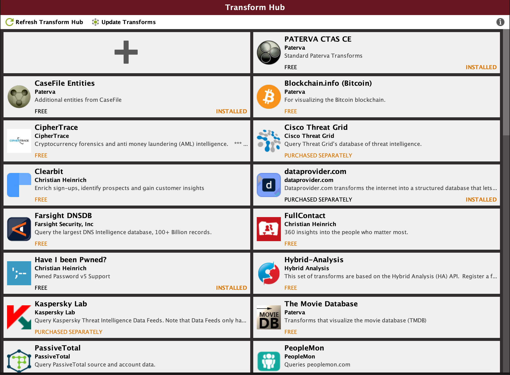

Maltego utilise des API pour connecter à d'autres applications et services. Maltego appelle ces connexions "Transforms" (transformations). 

Vous remarquerez qu'avec la version CE, certaines transformations sont gratuites et d'autres sont payantes. En plus, seul un petit groupe de transformations sont pré-installées. Il faudra donc dans certains cas s'enregistrer sur chaque site pour obtenir un accès à l'API de la transformation et l'activer. Ça dépendra de vos besoins.

Quelques transformations sont gratuites mais elles ne peuvent pas être installées sur la version gratuite de Maltego.

Nous pouvons commencer à travailler utilisant la config de base. La transformation Paterva CTAS CE est pré installée et elle fourni pas mal de fonctionnalités. On va rajouter quelques transforms intéressantes plus tard. 

## Une simple reconnaissance de réseau

En partant d'un nom de domaine, on peut commencer à mapper la structure d'une organisation. C'est assez surprenant la quantité d'information qui peut être disponible à partir de rien d'autre qu'un nom de domaine.

Cliquer sur le bouton **new graph** en haut, à gauche pour commencer un nouveau projet vide.

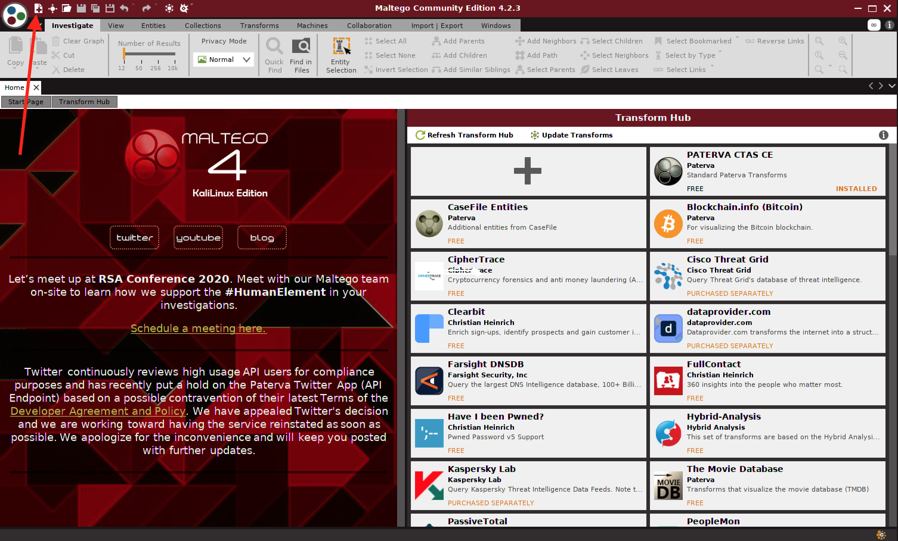

Depuis la palette d'entités (**Entity Palette**) à gauche, défilez vers le bas et trouvez l'entité **Domain**. Puis, faites-la glisser dans votre graph vierge. 

**Double-cliquez** sur l'icon **Domain** et changez le nom au domaine que vous voulez rechercher. Dans mon cas, j'ai choisi *heig-vd.ch*. Vous pouvez utiliser, par exemple, le domaine de l'entreprise que vous avez audité en AST, si vous avez suivi le cours. Sinon, sentez-vous libre de choisir un domaine qui vous paraît intéressant.

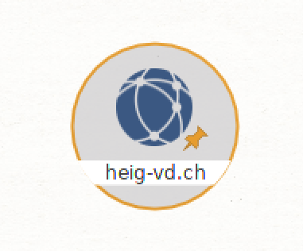

Un click droit sur l'icône Domain ouvre la fenêtre d'execution de transformations, la **Run Transforms** box. On peut être assez spécifique ici et sélectionner seulement ce qui nous intéresse. Pourtant, nous allons devenir fous et simplement choisir **Run All Transforms** on sélectionnant la petite icône "fast forward" à côté. 

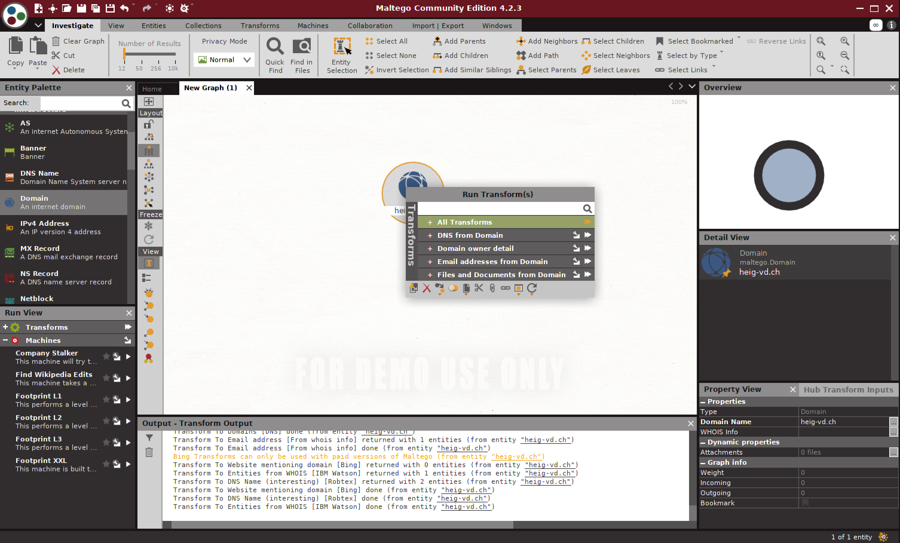

Dès que **Run Transform** est sélectionné, Maltego commence son travail en traçant la structure du réseau. **Remarque :** sur le côté gauche de l'interface du graphique, il existe plusieurs options pour visualiser le graphique sous différentes formes.

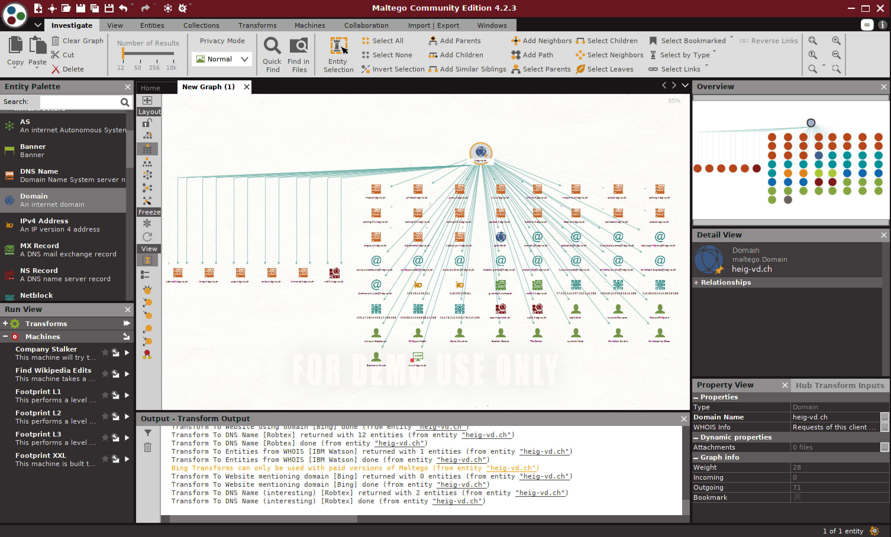

Vous pouvez voir dans les images ci-dessous que toutes sortes d'informations apparaissent, y compris les serveurs DNS, intranet, les sites qui peuvent avoir une certaine relation avec la cible, les emails associés, les serveurs de messagerie. Qu'est-ce que vous trouvez pour votre cas ? Faites des captures d'écran pour votre rendu et ajoutez vos commentaires !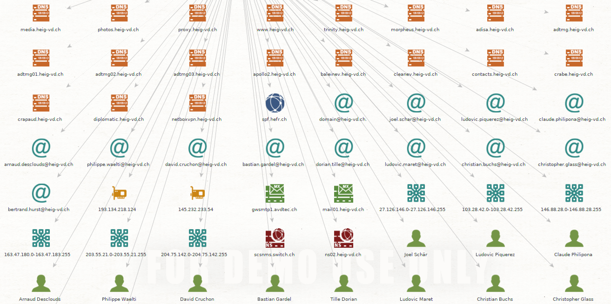

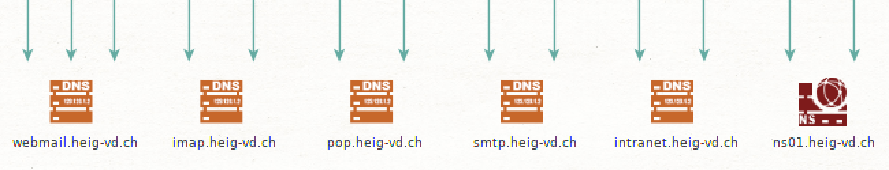

On peut utiliser ces connexions pour en faire des nouvelles encore plus détaillées. Par exemple, des noms associés avec des emails et même des numéros de téléphone (les numéros de téléphone sont difficiles à obtenir en Europe. La recherche pour les USA fonctionne correctement).

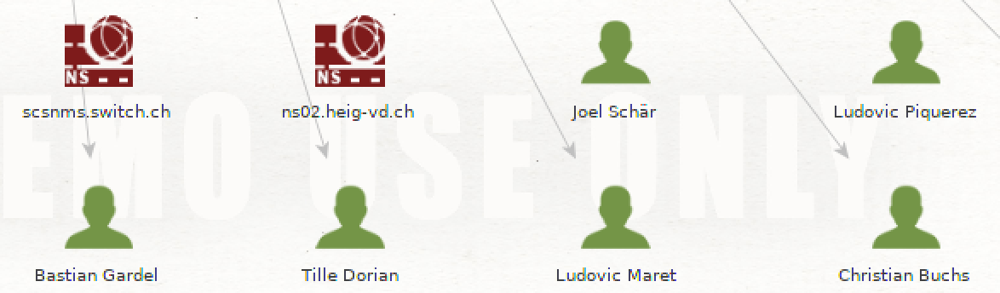

Regardons de plus près une personne qui apparaît comme étant connectée au domaine heig-vd.ch. Il s'agit de "Bastian Gardel". Je fais clique-droit sur l'icône de Bastien et **run All Transforms**. De votre côté, sélectionnez une identité trouvée pour votre domaine et exécutez vos transformations. N'oubliez pas de faire une capture et commenter. 

Lorsque les transformations seront terminées, nous aurons un graphique supplémentaire de quelques adresses email associées à Bastien Gardel. On y trouve aussi une clé PGP qui lui appartient, peut-être. J'ai vérifié avec Bastien et les adresses sont en effet des adresses email qu'il utilise ou il a utilisées. Dans certains cas, les résultats peuvent être assez étranges.

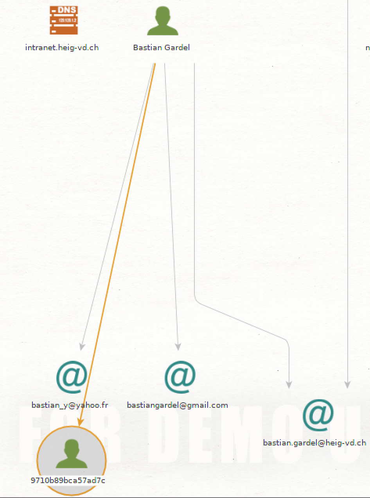

N'hésitez pas à tester d'autres domaines.

## Recherche d'une identité

Si vous avez déjà une identité d'une personne que vous voulez rechercher, vous pouvez procéder directement avec Maltego. Commencez avec un nouveau graphique et rajoutez une personne avec l'entité Person. 

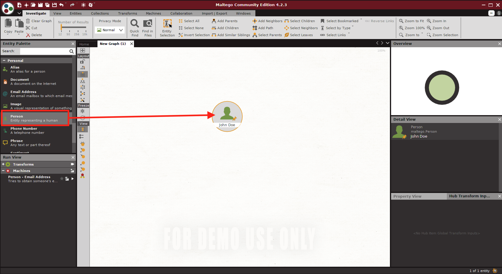

Je change l'identité de la personne en double cliquant sur l'icône et en introduisant mon nom.

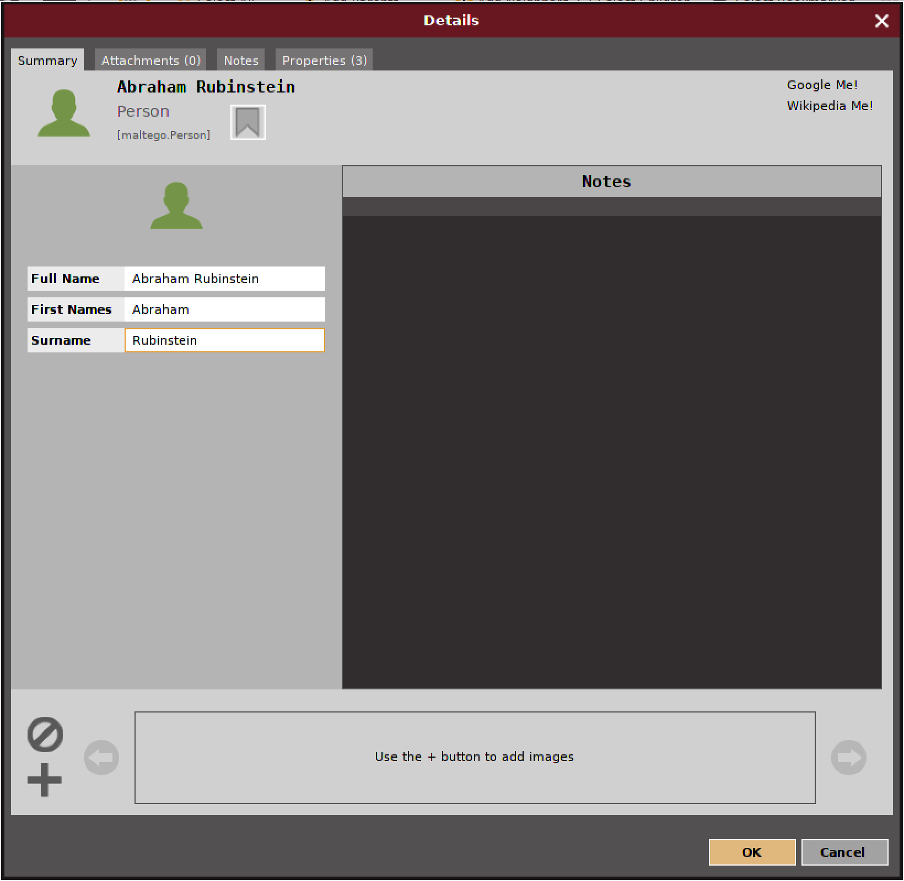

Ensuite, j'execute toutes les transformations sur la personne comme on l'a déjà fait pour les éléments du domaine.

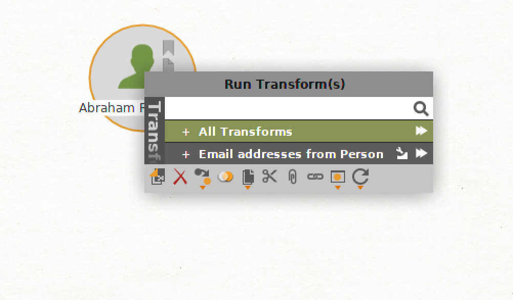

Dans mon cas, je trouve mon adresse email de la HEIG-VD et l'une de mes adresses prives.

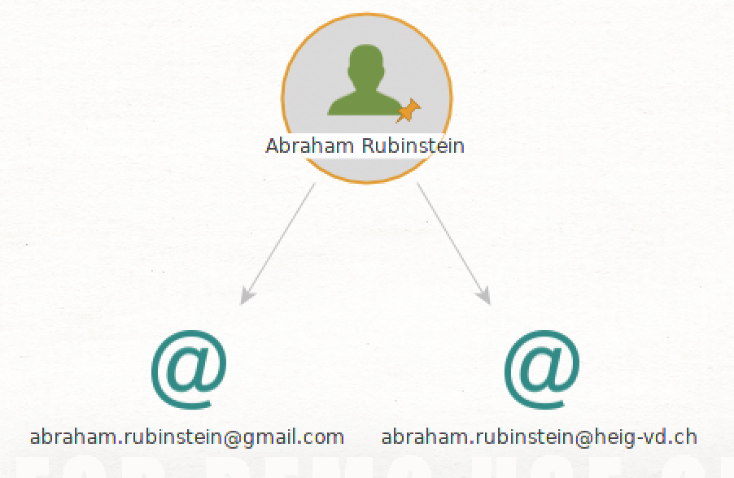

Faites quelques recherches, avec des noms que vous connaissez (vous-même y-compris). Est-ce que vous arrivez à trouver des adresses email associées ? N'oubliez pas vos captures et commentaires.

## Recherche d'une adresse email

Si vous n'avez pas le nom d'une personne, mais une adresse email, vous pouvez aussi commencer votre recherche directement par l'adresse en question. Dans ce cas là, le résultat de la recherche pourrait vous trouver l'identité associée à cette adresse ainsi que d'autres détails comme, par exemple, une organisation, un numéro de téléphone, etc.

Pour chercher une adresse email, il suffit d'utiliser l'entité **Email Address** dans la palette.

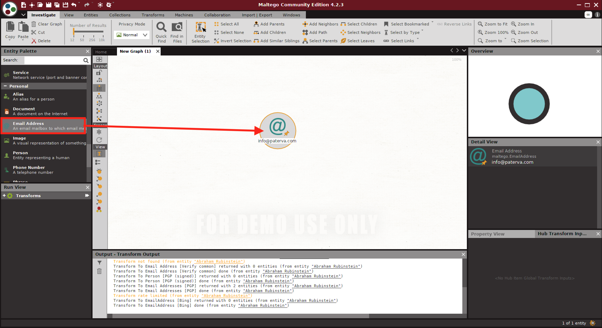

Réalisez des recherches avec quelques adresses que vous connaissez, de préférence liées à une organisation. Est-ce que ça vous permet de retrouver des liens intéressants avec l'organisation ? Qu'avez-vous retrouvé en plus ? Accompagnez vos réponses avec des captures d'écran et commentaires.

## Installation et utilisation de nouvelles transformations

Pour installer de nouvelles transforms, cliquez sur l'onglet "Transforms" et ensuite sur Transform Hub. Depuis le hub, vous pouvez installer de nouvelles transformations.

Commençons par VirusTotal Public API. VirusTotal peut analyser des fichiers et des URLs pour chercher des malwares. Cela permet, par exemple, de trouver des fichiers/URLs compromis chez une cible. Vous aurez besoin de [créer un compte]( https://www.virustotal.com/gui/join-us) pour avoir accès à une clé vous permettant d'utiliser l'API et donc, la transformation correspondante pour Maltego. Un lien pour trouver votre clé vous sera envoyé dans le même email utilisé pour l'activation du compte.

On va maintenant installer la Shodan Tranform. Shodan.io est un "analyseur d'Internet". Il donne des informations intéressantes (aussi de point de vue de la sécurité) sur des dispositifs connectés, des serveurs et services, etc. Pour comprendre ce que Shodan vous apporte à travers le Transform Maltego et comment ça marche, [vous pouvez lire cet article](http://maltego.blogspot.com/2016/04/abracadabra-its-shodan-time.html). Vous aurez besoin de [créer un compte](https://account.shodan.io/register) pour utiliser la transformation.

PassiveTotal est une plateforme de recherche de menaces. Le but est de contribuer à analyser la sécurité de systèmes pour prévenir les attaques avant qu'elles n 'arrivent. Pour activer cette transformation, il faut commencer par la [création d'un compte](https://community.riskiq.com/registration). Vous accédez ensuite à votre espace utilisateur (account) et révélez les valeurs cachées dans API ACCESS. Attention, la transformation vous demande un user et une clé (key). Ces deux valeurs correspondent respectivement à votre adresse email et à la valeur identifiée comme "secret" sur votre compte riskiq. Pour plus d'information sur cette transformation, ce référer à [cet article](https://blog.passivetotal.org/brand-new-maltego-transforms-and-code/).

Vous pouvez chercher vous même des informations sur d'autres transformations disponibles.

Procédez maintenant à relancer les recherches que vous avez déjà effectuées, mais utilisant exclusivement les transformations que vous venez d'installer. Est-ce que vous arrivez à trouver d'autres informations ? N'oubliez pas votre capture et commentaires.

## Et maintenant ?

Est-ce qu'il vous restent encore des transforms gratuites à installer ? Vous pouvez donc procéder à l'installation d'autres transformations intéressantes comme Have I Been Pwned?, dataprovider, Farsight DNSB, FullContact, etc. Avoir un plus grand nombre de transformations installés augmente considérablement les résultats. Par contre, le volume d'information peut être difficile à gérer et à comprendre. Vous pouvez dans tous le cas, appliquer les transformations une par une au lieu de toutes en même temps.

Faites une petite recherche sur Internet pour comprendre le type d'information que chaque transformation vous apporte (ce n'est pas toujours très clair...). Remplissez un petit tableau avec ces informations. Ça peut devenir utile quand vous avez beaucoup de transformations installées.

Utilisez donc ces nouvelles transformations que vous avez installé.

Tous les résultats sur le graph sont utilisables pour lancer des nouvelles recherches. Un clique-droit sur les différentes icônes vous permet de lancer des transformations à partir de cette entité. Vous pouvez lancer des transformations sur des numéros de téléphone, des services, des adresses IP, des coordonnées, des documents, etc.

Utilisez quelques résultats retrouvés lors de vos recherches précédentes pour lancer des transformations sur d'autres entités de types différents à celles que vous avez déjà testé (Person, Domain, email). Est-ce que vous arrivez à trouver quelque chose d'intéressant ? Est-ce que le graph devient difficile à gérer ? Documentez vos activités avec des captures et des commentaires.

[GitHub est aussi une source précieuse de transformations](https://github.com/search?q=maltego+transform) qui ne se trouvent pas dans le Hub. Est-ce que vous avez une idée pour une transformation ? Vous pouvez [les developper vous même](https://docs.maltego.com/support/solutions/articles/15000017605-writing-local-transforms-in-python) aussi en python ! 

# Livrable

Captures d'écran et commentaires en format PDF ou directement sur le README.md

Le rendu se fait à travers un "pull request". 

-----

# Réalisation

### Reconnaissance de réseau

Le domain `ehnv.ch` a été choisi comme cible. On peut constater que Maltego arrive a récupéré un bon nombre d'éléments comme adresses mails, des serveurs de messageries, leur site internet et les archives de celui-ci ainsi que des serveurs DNS.

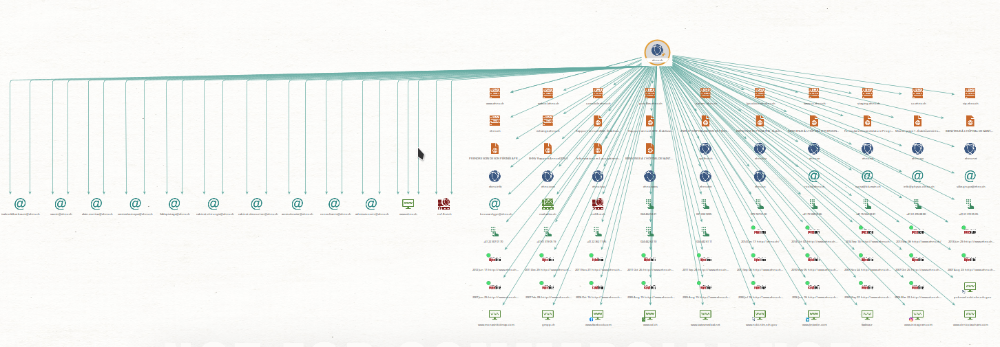

Un certains nombres d'adresses emails ont été trouvé, se sont des adresses génériques ainsi que des personnelles. Il y a aussi des numéros de téléphones qui permettent de joindre différents services de l'eHnv. 

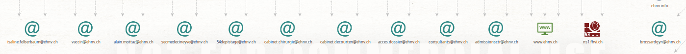

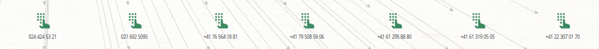

L'eHnv aussi connue sous établissements hospitaliers du Nord vaudois fait partie de la FHV (Fédération des hôpitaux vaudois) avec tous les autres hôpitaux du canton de Vaud. Pour tout ce qui concerne les systèmes informatiques des hôpitaux, ils sont régis par la FHVI (entité informatique de la FHV). On constatera donc qu'il y a deux NS Record relié à la fhvi (`ns1.fhvi.ch` et `ns2.fhvi.ch`). Lorsqu'on `run all transforms` dessus, on obtient des informations supplémentaires sur la fhvi.

On retrouve des serveurs DNS, des noms de domaines en relation, une plage IPv4 bloquée (`194.209.198.0 à 194.209.198.255`)pour se NS ainsi que son adresse IP (`194.209.198.72`).

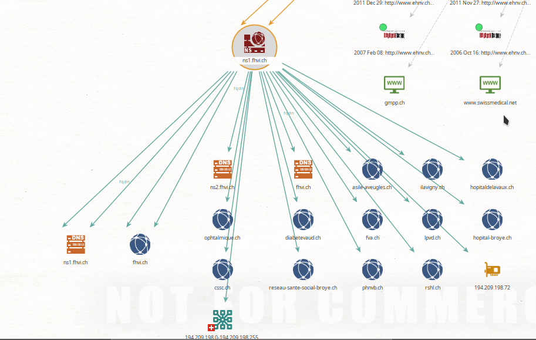

J'ai vérifié que l'adresse IP de `ns1.fhvi.ch` soit celle obtenue avec la commande `nslookup` ce qui correspond.

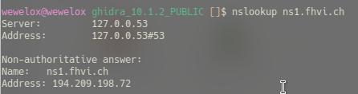

### Recherche d'une identité

Dans un premier temps, je me suis recherché afin de découvrir les informations publiques disponible sur moi. Seul l'un des liens linkedin, github et le gymnase de burier me conserne. Toutes les autres informations n'ont aucun rapport avec moi.

Cependant, ayant 3 manières différentes d'écrire mon nom de famille le résultat est parfois différents.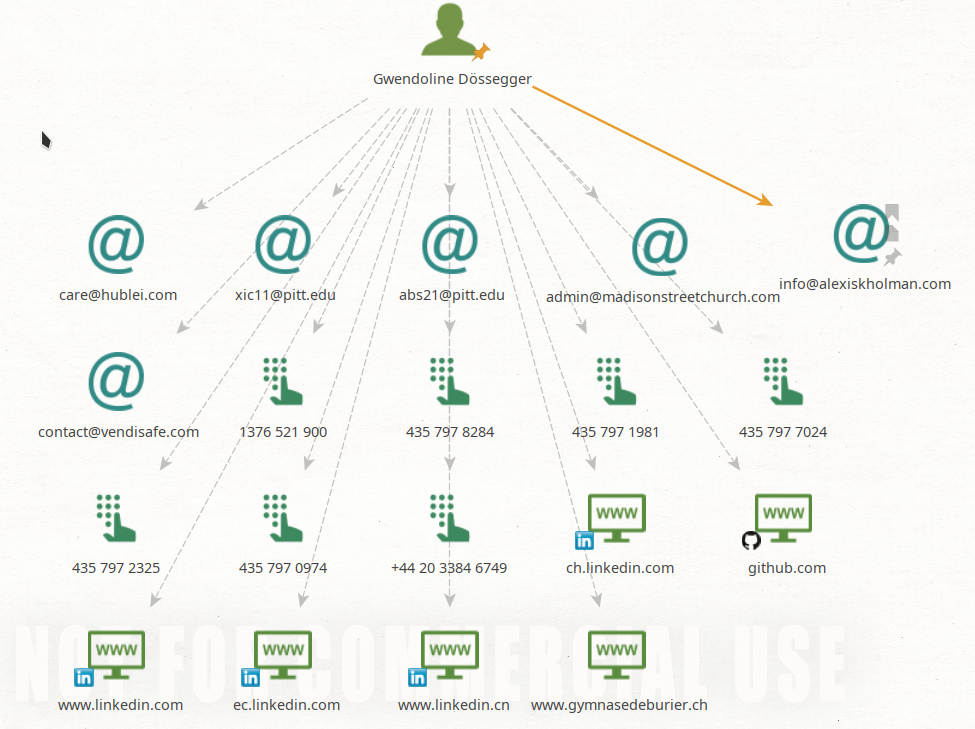

Pour continuer avec l'eHnv, j'ai pris son directeur général Jean-François Cardis (selon leur site internet).

On peut constater que son adresse email professionnelle a été trouvée, son compte linkedin, une ancienne présentation réalisée en 2013 (départ de son poste Directeur de soins) ainsi que des articles où il a été cité / participé (24heures, ...).

Son adresse mail est une cible idéale pour du fishing visé. La récupération potentielle de ses identifiants permettrait à l'attaquant d'avoir accès à un compte de l'un des plus hauts statuts hiérarchique dans l'entreprise. 

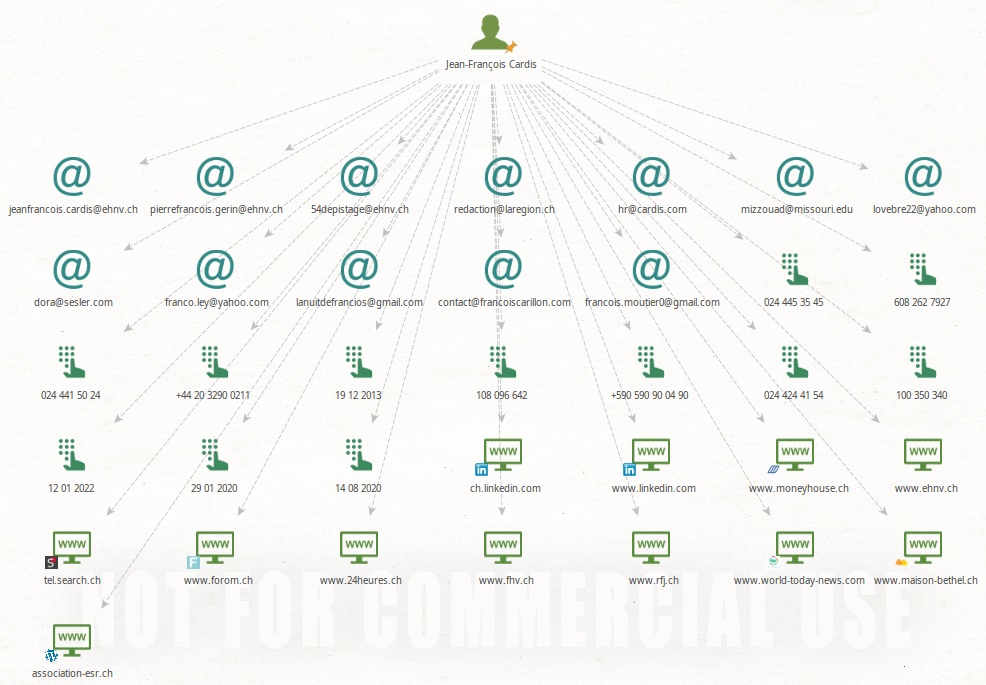

### Recherche d'une adresse email

J'ai recherché mon adresse email de l'école. Maltego récupère les informations ci-dessous. Il détecte correctement que l'adresse email est valide et existe ainsi que mon identité et le domaine `heig-vd.ch`. Il récupère aussi le niveau de `Deliverability` qui est à `high` (score de fraude de l'adresse). 

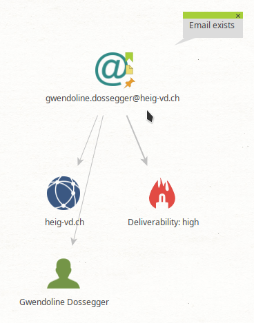

### Installation et utilisation de nouvelles transformations

> VirusTotal

VirusTotal permet de vérifier si des URLs et des fichiers sont vulnérables à des malwares selon leur hash. Dans notre cas, j'ai continué avec l'eHnv et plus précisément l'URL `ehnv.ch`. 

On remarque que ce transforms permet d'obtenir plus d'informations que précédemment comme par exemple : les certificats SSL pour le domaine.

De plus, certains résultats possèdent un "rond" de couleur indiquant si l'élément est vulnérable :

- Rond vert (harmless): aucune menace n'a été trouvée
- Rond jaune (undetected) : un ou plusieurs fournisseurs ont détectés l'élément de potentiellenent malveillant
- Rond rouge (malicious): élément malveillant
- Rond noir (undetected) : rien n'est détecté par un fournisseur

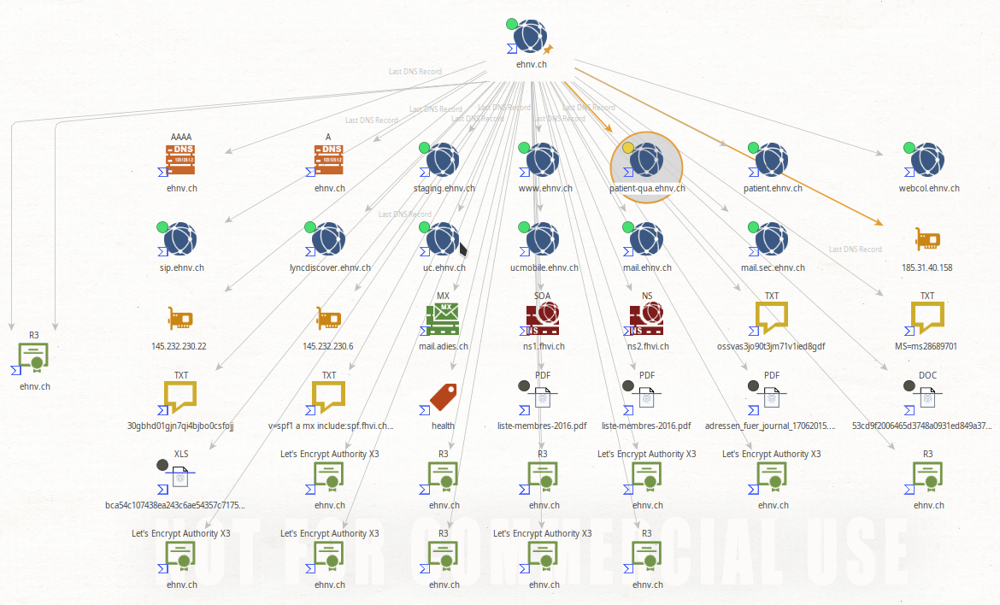

On a analysé les informations qu'indique VirusTotal pour l'URL `www.ehnv.ch`. On constate qu'aucun partenaire n'a détecté un malware et est donc indiqué comme secure.

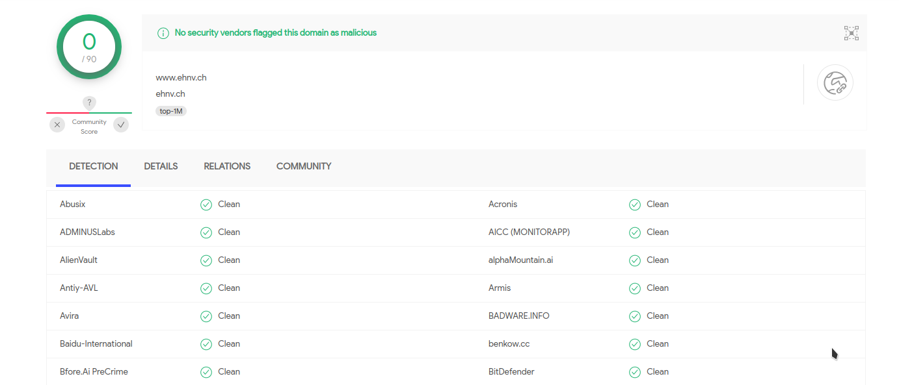

On remarque que seul un élément, `patient-qua.ehnv.ch`, semble potentiellement vulnérable et donc `Quttera` a des suspicions. 

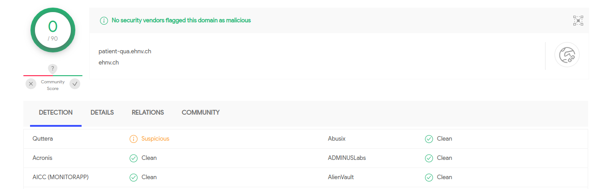

> Shodan Transform

En continuant avec le même nom de domaine, il a été possible de récupérer une adresse IP qui correspond à l'hébergeur Web de l'établissement nord Vaudois. Avec cette adresse IP `185.31.40.158`, j'ai re effectué une recherche avec Shodan. On obtient alors les informations suivants :

- Entreprise : `ALWAYSDATA SARL` localisée à `Paris - FR` 
- ISP - Fournisseur d'accès internet : `ALWAYSDATA SARL`
- Les ports ouverts : 80 (HTTP), 21/22 (FTP), 25 (SMTP), ... se sont des ports "basiques" pour un hébergeur Web. 

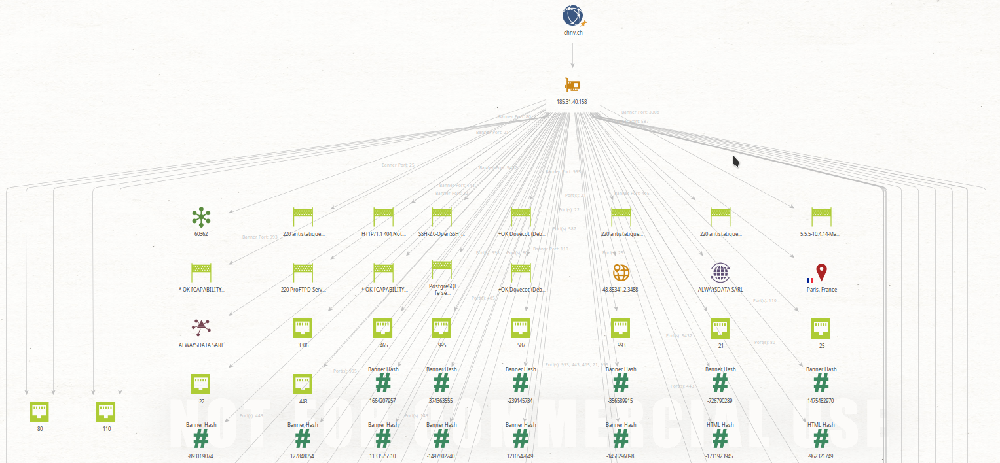

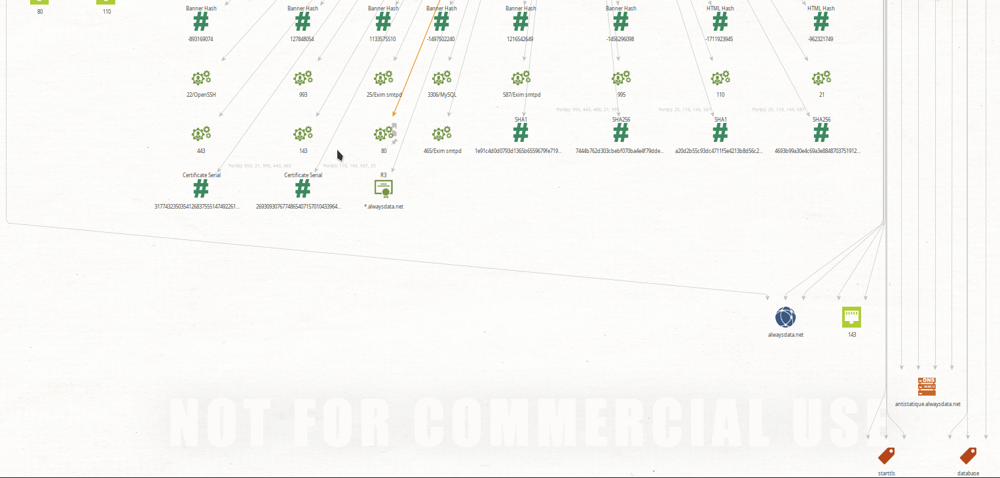

> PassiveTotal

À l'aide de PassiveTotal, il est possible de voir les sous-domaines en relation avec `ehnv.ch`. On retrouve par exemple `mail.ehnv.ch`, `ucmobile.ehnv.ch` ou encore `patient.ehnv.ch`.  

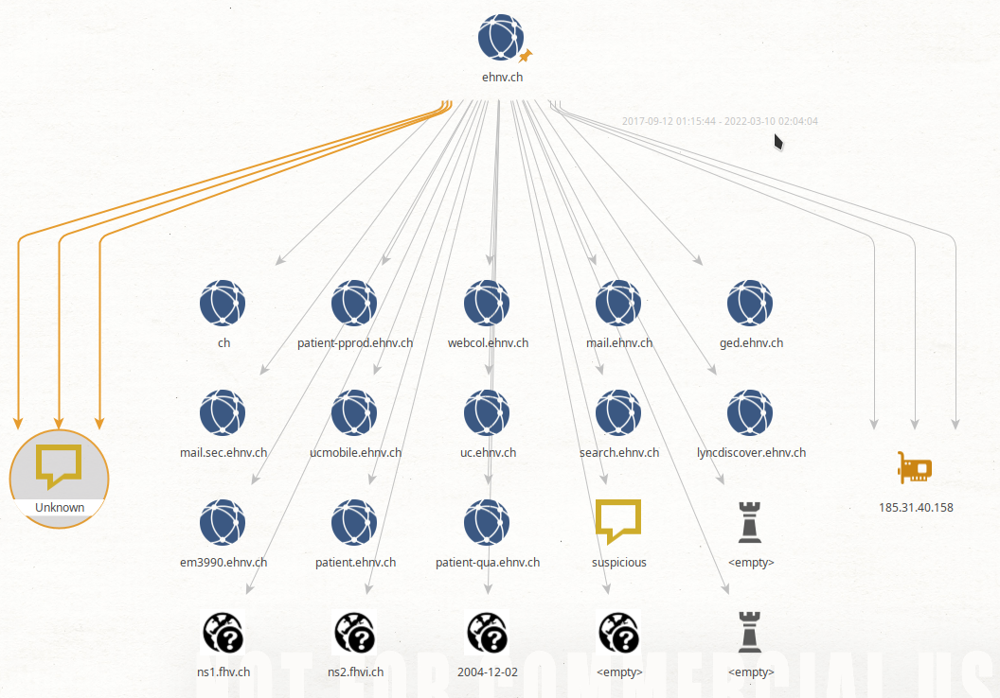

D'autres informations comme les serveurs WHOIS sont correctement détecté : `ns1.fv.ch` et `ns2.fhvi.ch`

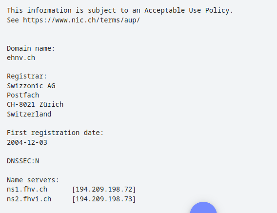

### Et maintenant 

Récapitulatifs des outils Transforms installés : 

| Transforms            | Description                                                  |
| --------------------- | ------------------------------------------------------------ |
| Have I Been Pwned?    | Indique si des données comme l'email, le mot de passe ou le numéro de téléphone on été leaked |
| Farsight DNSB         | Informations selon une base de données DNS                   |
| FullContact           | Récupère un ensemble de données (email, Twitter, domaines, identité, numéro de téléphone, ...) |
| VirusTotal Public API | Analyse les fichiers et les URLs pour détecter des vulnérabilités à des malwares |
| Shodan                | Récupère des informations sur des DNS, URL, IP, ...          |
| PassiveTotal API      | Recherche des enregistrements WHOIS, des menaces, des résolutions IP, DNS, et certificats SSL, ... |
| Social Links CE       | Récupère des informations sur les réseaux sociaux à partir d'un email |

> Have I Been Pwned ?

Pour ce transform, je l'ai d'abord appliqué à mon adresse de l'école. Et il est possible de voir qu'il n'a fuité sur aucun site. J'ai aussi lancé Social Links CE sur mon adresse email mais les documents cloud affiché ne me concerne pas.

|  | 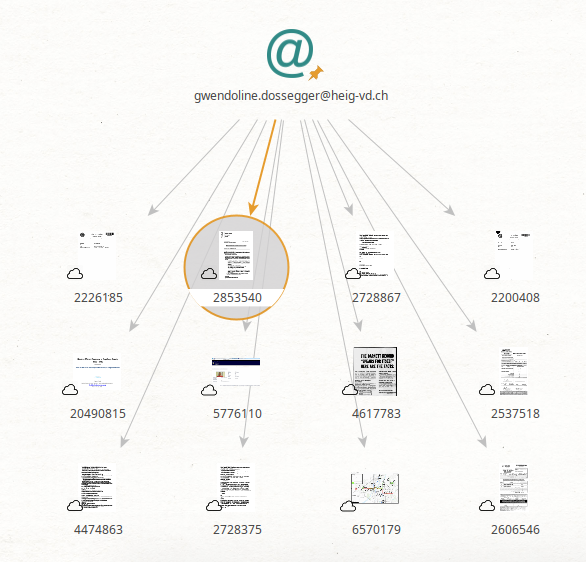 |
| --------------------- | ------------------------- |

J'ai ensuite effectué le même transform, mais cette fois-ci, pour le directeur de l'ehnv. On constate que son adresse mail aurait été leak autant linkedin que sur covve.com. Puis, j'ai utilisé le transform Social Links sur son adresse mais cette fois-ci aucune information n'a été trouvé. 

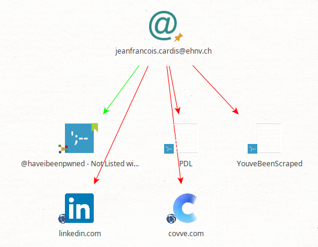

J'ai appliqué ensuite FullContact à cette adresse mail. Étant une adresse d'entreprise, on obtient pas de résultat que l'on ne connaissait pas. 

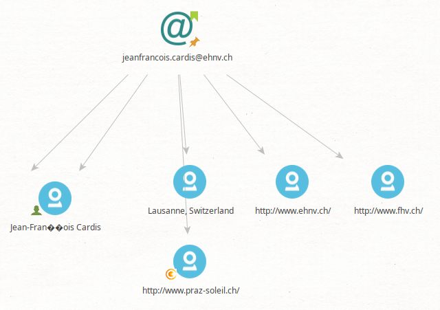

Lors de l'exécution des transforms, je suis partie à chaque fois qu'un élément "vierge" car plus on ajoute de transforme plus de données sont affichées et les graphs grandissent très vite. Ils deviennent un peu "indigeste" pour les parcourir et les prendre en capture.

# Echéance

Le 14 avril 2022 à 10h25
