# Labo découverte Maltego

> Auteur: Noémie Plancherel

## Introduction

Maltego est un outil de data mining capable d'explorer une variété de ressources de données open-source et utilise ces données pour créer des graphs permettant d'analyser des éventuelles connexions identifiées entre ces différentes ressources.

Les graphs permettent de faire des connexions entre des informations comme le nom d'une organisation, les adresse email et son structure organisationnelle, des domaines, des documents, etc.

Maltego est écrit en Java, ce qui lui permet de fonctionner sur Windows, Mac et Linux. Il est pré-installé sur Kali.

Dans la pratique, Maltego recherche et parse des grandes quantités d'information à partir de sites publiques et produit un jolie graph pour vous aider à rassembler les pièces du puzzle.

Maltego peut être utilisé en tout moment pendant un audit. Pourtant, si la cible est un domaine, c'est raisonnable de mapper le réseau depuis le début avec Maltego.

## Téléchargement et installation

Il y a plusieurs version de Maltego :

- Maltego XL : version premium pour de grandes quantités de données
- Maltego Classic : version payante qui inclut toutes les "transformations"
- Maltego CE (Community Edition) : Version gratuite avec des "transformations" limitées
- Casefile : pour examiner des liens sur des données offline

Nous allons travailler avec la version gratuite, Maltego CE.

### Installation

- Kali : comme déjà mentionné, Maltego est déjà pré-installé sur Kali. Vous aurez quand-même besoin de vous rendre sur le [site de Maltego](https://www.maltego.com/ce-registration/) pour créer un compte CE. Une fois votre compte crée, vous recevrez une clé qui vous permettra d'utiliser la Community Edition.
- Téléchargement : si vous installez Maltego sur votre machine Windows, Mac ou autre version de Linux, vous pouvez le [télécharger ici](https://www.maltego.com/downloads/). Il vous faudra le [compte CE](https://www.maltego.com/ce-registration/) aussi pour cette version. 

## Transforms

Maltego utilise des API pour connecter à d'autres applications et services. Maltego appelle ces connexions "Transforms" (transformations). 

Vous remarquerez qu'avec la version CE, certaines transformations sont gratuites et d'autres sont payantes. En plus, seul un petit groupe de transformations sont pré-installées. Il faudra donc dans certains cas s'enregistrer sur chaque site pour obtenir un accès à l'API de la transformation et l'activer. Ça dépendra de vos besoins.

Quelques transformations sont gratuites mais elles ne peuvent pas être installées sur la version gratuite de Maltego.

Nous pouvons commencer à travailler utilisant la config de base. La transformation Paterva CTAS CE est pré installée et elle fourni pas mal de fonctionnalités. On va rajouter quelques transforms intéressantes plus tard. 

## Une simple reconnaissance de réseau

En partant d'un nom de domaine, on peut commencer à mapper la structure d'une organisation. C'est assez surprenant la quantité d'information qui peut être disponible à partir de rien d'autre qu'un nom de domaine.

Cliquer sur le bouton **new graph** en haut, à gauche pour commencer un nouveau projet vide.

Depuis la palette d'entités (**Entity Palette**) à gauche, défilez vers le bas et trouvez l'entité **Domain**. Puis, faites-la glisser dans votre graph vierge. 

**Double-cliquez** sur l'icon **Domain** et changez le nom au domaine que vous voulez rechercher. Dans mon cas, j'ai choisi *heig-vd.ch*. Vous pouvez utiliser, par exemple, le domaine de l'entreprise que vous avez audité en AST, si vous avez suivi le cours. Sinon, sentez-vous libre de choisir un domaine qui vous paraît intéressant.

Un click droit sur l'icône Domain ouvre la fenêtre d'execution de transformations, la **Run Transforms** box. On peut être assez spécifique ici et sélectionner seulement ce qui nous intéresse. Pourtant, nous allons devenir fous et simplement choisir **Run All Transforms** on sélectionnant la petite icône "fast forward" à côté. 

Dès que **Run Transform** est sélectionné, Maltego commence son travail en traçant la structure du réseau. **Remarque :** sur le côté gauche de l'interface du graphique, il existe plusieurs options pour visualiser le graphique sous différentes formes.

Vous pouvez voir dans les images ci-dessous que toutes sortes d'informations apparaissent, y compris les serveurs DNS, intranet, les sites qui peuvent avoir une certaine relation avec la cible, les emails associés, les serveurs de messagerie. Qu'est-ce que vous trouvez pour votre cas ? Faites des captures d'écran pour votre rendu et ajoutez vos commentaires !

On peut utiliser ces connexions pour en faire des nouvelles encore plus détaillées. Par exemple, des noms associés avec des emails et même des numéros de téléphone (les numéros de téléphone sont difficiles à obtenir en Europe. La recherche pour les USA fonctionne correctement).

Regardons de plus près une personne qui apparaît comme étant connectée au domaine heig-vd.ch. Il s'agit de "Bastian Gardel". Je fais clique-droit sur l'icône de Bastien et **run All Transforms**. De votre côté, sélectionnez une identité trouvée pour votre domaine et exécutez vos transformations. N'oubliez pas de faire une capture et commenter. 

Lorsque les transformations seront terminées, nous aurons un graphique supplémentaire de quelques adresses email associées à Bastien Gardel. On y trouve aussi une clé PGP qui lui appartient, peut-être. J'ai vérifié avec Bastien et les adresses sont en effet des adresses email qu'il utilise ou il a utilisées. Dans certains cas, les résultats peuvent être assez étranges.

N'hésitez pas à tester d'autres domaines.

## Recherche d'une identité

Si vous avez déjà une identité d'une personne que vous voulez rechercher, vous pouvez procéder directement avec Maltego. Commencez avec un nouveau graphique et rajoutez une personne avec l'entité Person. 

Je change l'identité de la personne en double cliquant sur l'icône et en introduisant mon nom.

Ensuite, j'execute toutes les transformations sur la personne comme on l'a déjà fait pour les éléments du domaine.

Dans mon cas, je trouve mon adresse email de la HEIG-VD et l'une de mes adresses prives.

Faites quelques recherches, avec des noms que vous connaissez (vous-même y-compris). Est-ce que vous arrivez à trouver des adresses email associées ? N'oubliez pas vos captures et commentaires.

## Recherche d'une adresse email

Si vous n'avez pas le nom d'une personne, mais une adresse email, vous pouvez aussi commencer votre recherche directement par l'adresse en question. Dans ce cas là, le résultat de la recherche pourrait vous trouver l'identité associée à cette adresse ainsi que d'autres détails comme, par exemple, une organisation, un numéro de téléphone, etc.

Pour chercher une adresse email, il suffit d'utiliser l'entité **Email Address** dans la palette.

Réalisez des recherches avec quelques adresses que vous connaissez, de préférence liées à une organisation. Est-ce que ça vous permet de retrouver des liens intéressants avec l'organisation ? Qu'avez-vous retrouvé en plus ? Accompagnez vos réponses avec des captures d'écran et commentaires.

## Installation et utilisation de nouvelles transformations

Pour installer de nouvelles transforms, cliquez sur l'onglet "Transforms" et ensuite sur Transform Hub. Depuis le hub, vous pouvez installer de nouvelles transformations.

Commençons par VirusTotal Public API. VirusTotal peut analyser des fichiers et des URLs pour chercher des malwares. Cela permet, par exemple, de trouver des fichiers/URLs compromis chez une cible. Vous aurez besoin de [créer un compte]( https://www.virustotal.com/gui/join-us) pour avoir accès à une clé vous permettant d'utiliser l'API et donc, la transformation correspondante pour Maltego. Un lien pour trouver votre clé vous sera envoyé dans le même email utilisé pour l'activation du compte.

On va maintenant installer la Shodan Tranform. Shodan.io est un "analyseur d'Internet". Il donne des informations intéressantes (aussi de point de vue de la sécurité) sur des dispositifs connectés, des serveurs et services, etc. Pour comprendre ce que Shodan vous apporte à travers le Transform Maltego et comment ça marche, [vous pouvez lire cet article](http://maltego.blogspot.com/2016/04/abracadabra-its-shodan-time.html). Vous aurez besoin de [créer un compte](https://account.shodan.io/register) pour utiliser la transformation.

PassiveTotal est une plateforme de recherche de menaces. Le but est de contribuer à analyser la sécurité de systèmes pour prévenir les attaques avant qu'elles n 'arrivent. Pour activer cette transformation, il faut commencer par la [création d'un compte](https://community.riskiq.com/registration). Vous accédez ensuite à votre espace utilisateur (account) et révélez les valeurs cachées dans API ACCESS. Attention, la transformation vous demande un user et une clé (key). Ces deux valeurs correspondent respectivement à votre adresse email et à la valeur identifiée comme "secret" sur votre compte riskiq. Pour plus d'information sur cette transformation, ce référer à [cet article](https://blog.passivetotal.org/brand-new-maltego-transforms-and-code/).

Vous pouvez chercher vous même des informations sur d'autres transformations disponibles.

Procédez maintenant à relancer les recherches que vous avez déjà effectuées, mais utilisant exclusivement les transformations que vous venez d'installer. Est-ce que vous arrivez à trouver d'autres informations ? N'oubliez pas votre capture et commentaires.

## Et maintenant ?

Est-ce qu'il vous restent encore des transforms gratuites à installer ? Vous pouvez donc procéder à l'installation d'autres transformations intéressantes comme Have I Been Pwned?, dataprovider, Farsight DNSB, FullContact, etc. Avoir un plus grand nombre de transformations installés augmente considérablement les résultats. Par contre, le volume d'information peut être difficile à gérer et à comprendre. Vous pouvez dans tous le cas, appliquer les transformations une par une au lieu de toutes en même temps.

Faites une petite recherche sur Internet pour comprendre le type d'information que chaque transformation vous apporte (ce n'est pas toujours très clair...). Remplissez un petit tableau avec ces informations. Ça peut devenir utile quand vous avez beaucoup de transformations installées.

Utilisez donc ces nouvelles transformations que vous avez installé.

Tous les résultats sur le graph sont utilisables pour lancer des nouvelles recherches. Un clique-droit sur les différentes icônes vous permet de lancer des transformations à partir de cette entité. Vous pouvez lancer des transformations sur des numéros de téléphone, des services, des adresses IP, des coordonnées, des documents, etc.

Utilisez quelques résultats retrouvés lors de vos recherches précédentes pour lancer des transformations sur d'autres entités de types différents à celles que vous avez déjà testé (Person, Domain, email). Est-ce que vous arrivez à trouver quelque chose d'intéressant ? Est-ce que le graph devient difficile à gérer ? Documentez vos activités avec des captures et des commentaires.

[GitHub est aussi une source précieuse de transformations](https://github.com/search?q=maltego+transform) qui ne se trouvent pas dans le Hub. Est-ce que vous avez une idée pour une transformation ? Vous pouvez [les developper vous même](https://docs.maltego.com/support/solutions/articles/15000017605-writing-local-transforms-in-python) aussi en python ! 

# Livrable

Captures d'écran et commentaires en format PDF ou directement sur le README.md

Le rendu se fait à travers un "pull request". 

# Echéance

Le 14 avril 2022 à 10h25

# Questions

>  Question 1 - Reconnaissance réseau :

La recherche via le nom de domaine *heig-vd.ch* donne le résultat ci-dessous. Nous pouvons constater que Maltego a trouvé beaucoup d'informations différentes liées au nom de domaine.

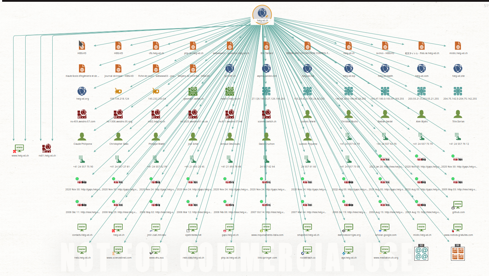

Notamment, nous avons pu récupérer des personnes ainsi que des numéros de téléphone fixe. En récupérant des noms de personnes, il est possible par la suite de se concentrer sur une seule et de faire une recherche plus approfondie sur cette dernière afin de récupérer des informations personnelles.

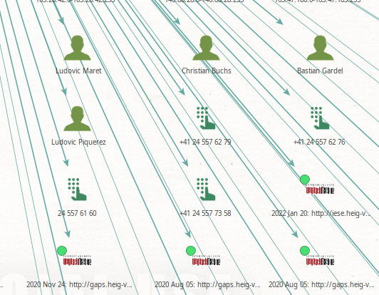

Finalement, nous pouvons aussi obtenir des sites web liés au nom de domaine, comme par exemple ici *gaps.heig-vd.ch* ou encore le site officiel *heig-vd.ch*.

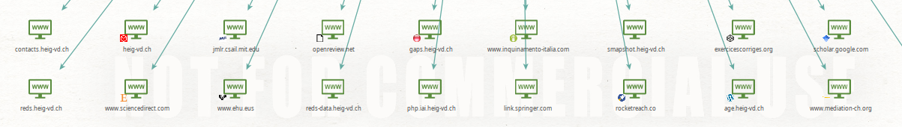

J'ai effectué la même recherche avec l'entreprise chez qui j'ai réalisé mon projet de AST qui possède le nom de domaine `lerepuis.ch`.

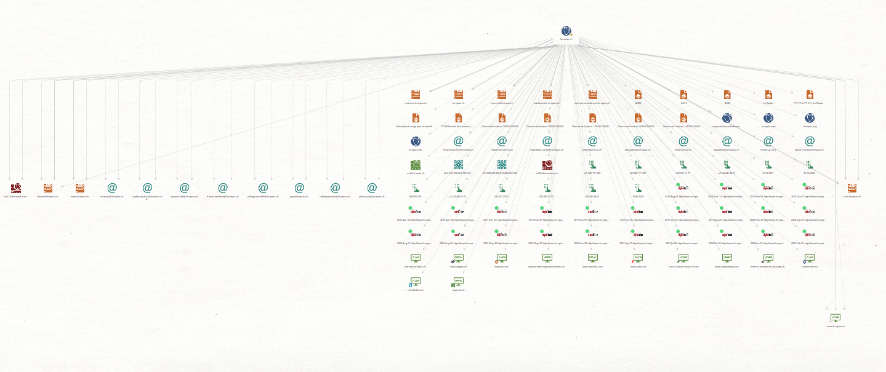

Nous constatons que, comme pour *heig-vd.ch*, la recherche a retourné plusieurs noms de sous-domaines différents (`extranet.lerepuis.ch`, `mail.lerepuis.ch`), des adresses e-mails ainsi qu'un NS Record `ns32.infomaniak.com` qui est directement lié à Infomaniak.

> Question 2 - Reconnaissance réseau sur une personne

La personne séléctionnée est *Christian Buchs*. Nous remarquons qu'on a pu récupérer plusieurs adresses e-mails différentes dont son adresse e-mail de la heig-vd. À part quelques comptes sur des site comme *LinkedIn* ou *Facebook*, le reste ne sont pas des informations très pertinentes pour la personne recherchée.

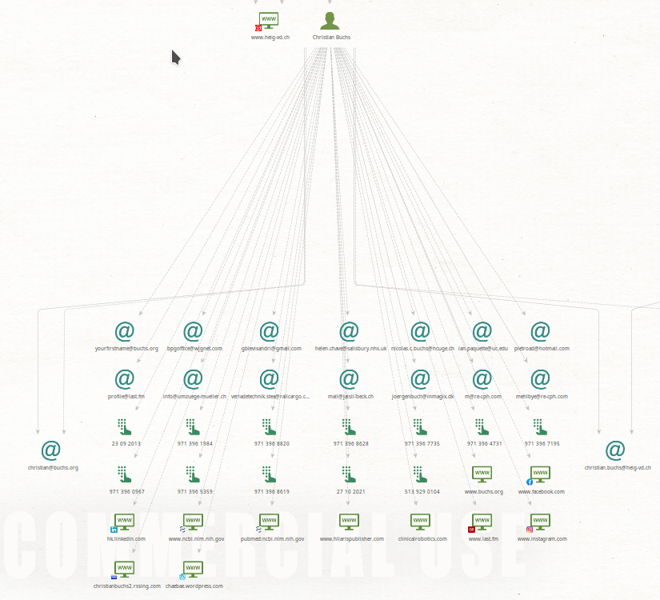

> Question 3 - Recherche d'identité

J'ai effectué une première recherche avec mon identité; nous pouvons remarquer ci-dessous qu'il n'y a aucune adresse e-mail qui est liée avec moi. Il y a quelques sites qui apparaissent sur lesquels j'apparais ou sur lesquels j'ai un compte, notammant *Facebook* ou *LinkedIn*. Mais comme précédemment, le reste des informations retournées ne sont pas très pertinentes.

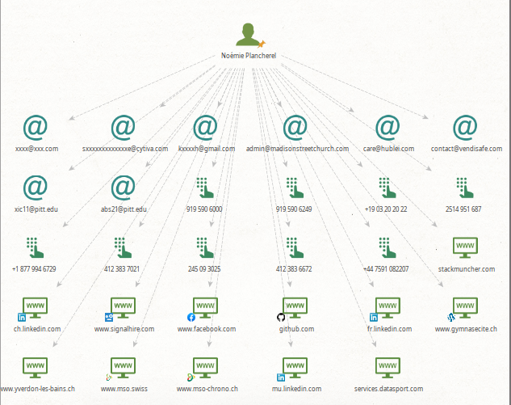

J'ai effectué la même recherche mais avec *Alexandre Duc*; j'ai pu récupérer deux adresses e-mails qui doivent lui appartenir, *alexandre.duc@heig-vd.ch* et *alexandre.duc@epfl.ch*. Il y a également 3 numéros de téléphones suisses, deux fixes et un téléphone portable.

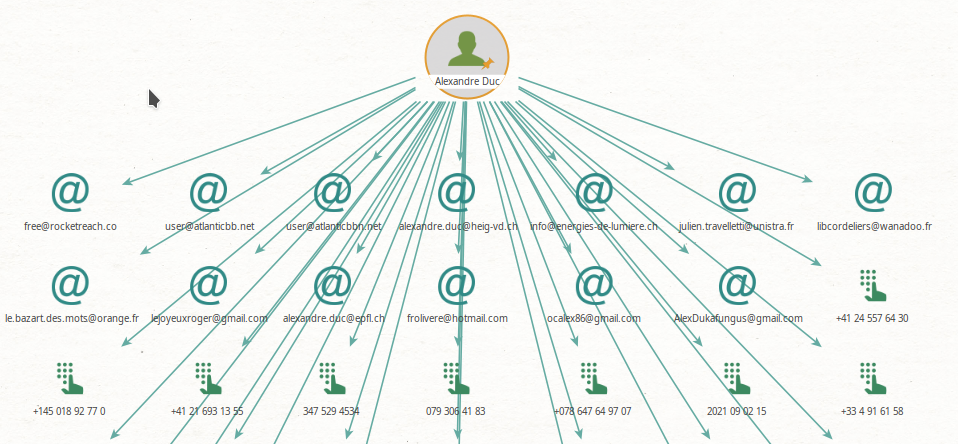

> Question 4 - Recherche d'une adresse e-mail

J'ai fait une première recherche d'adresse e-mail avec mon adresse personnelle de l'école *noemie.plancherel@heig-vd.ch*. Nous pouvons constater que l'adresse est correctement reliée au nom de domaine *heig-vd.ch* et à ma propre identité *Noemie Plancherel*, ce qui permettrait de faire par la suite une recherche d'identité avec mon nom. De plus, nous voyons que Maltego a pu vérifier que l'e-mail existait réellement.

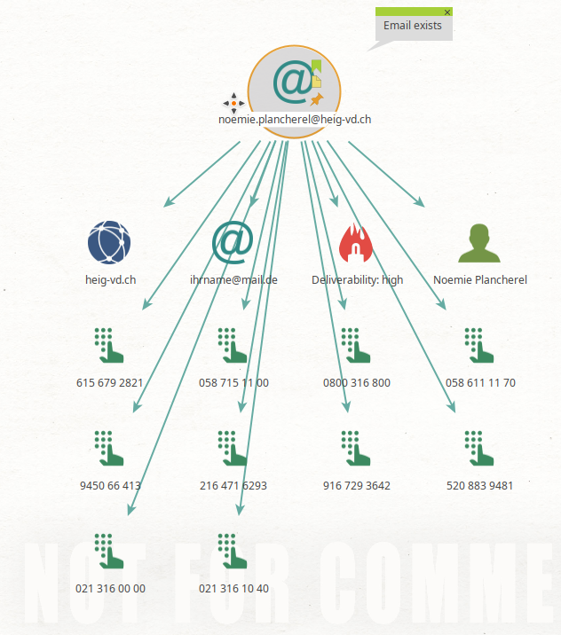

J'ai effectué une seconde recherche avec l'e-mail de mon client du cours AST. On constate que l'e-mail est correctement lié au nom de domaine *lerepuis.ch*, cependant on voit que l'e-mail a été leaked suite à une attaque d'un site où un attaquant a pu récolter des adresses e-mails d'utilisateurs. De plus, cette adresse e-mail aurait été utilisée pour des comptes *YouTube*, *Telegram* ou encore *Twitter*.

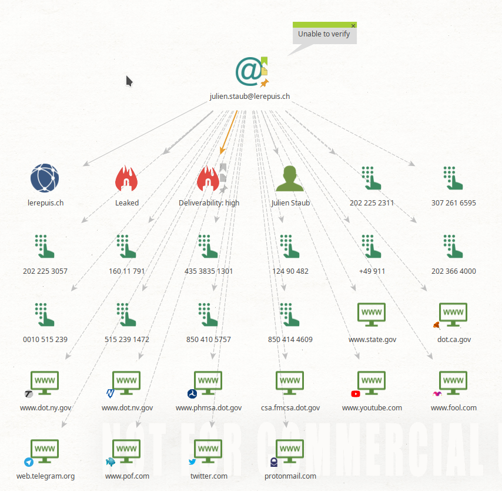

> Question 5 - Ajout de nouveaux transforms

> VirusTotal

Ce transform va permettre d'analyser des URLs ainsi que des fichiers pour vérifier s'il existe des malwares. Pour cette partie, j'ai décidé de continuer de faire des recherches avec mon client du cours de AST; j'ai ainsi fait une recherche via le nom de domaine *lerepuis.ch*. 

Nous voyons ci-dessous qu'en comparaison avec les recherches précédentes, des éléments supplémentaires sont apparus, comme un certificat *Sectigo RSA Domain Validation Secure Server CA* pour les sous-domaines **.webexpert.ch*.

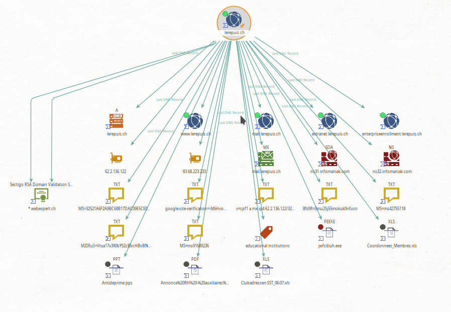

De plus, nous pouvons constater plusieurs type de résultats différents en fonction de l'analyse de virus de VirusTotal:

- Pastille verte: *harmless*, aucun partenaire de VirusTotal n'a détecté de virus
- Pastille rouge: *malicious*, plusieurs partenaires ont détecté l'élément comme étant malveillant.
- Pastille noire: *undetected*, aucun partenaire de VirusTotal n'a détecté de virus

Pour chaque élément analysé, chaque partenaire de sécurité vérifie si l'élément pourrait contenir un virus ou pourrait être malveillant. Dans les partenaires, nous pouvons retrouver *Fortinet*, *Avast*, *Acronis*, ...

Ainsi, nous pouvons à chaque fois récupérer un rapport final avec chaque résultat des fournisseurs. Ci-dessous un rapport d'un élément *harmless*:

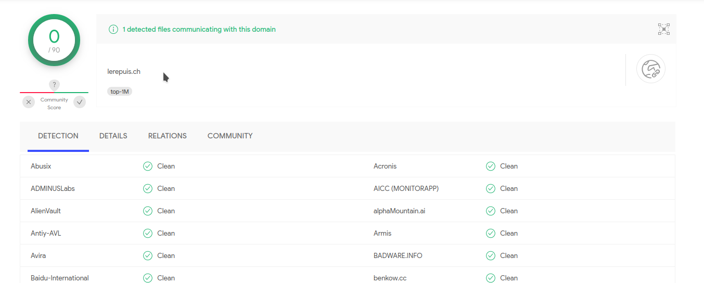

En comparaison avec un fichier `.exe` malveillant:

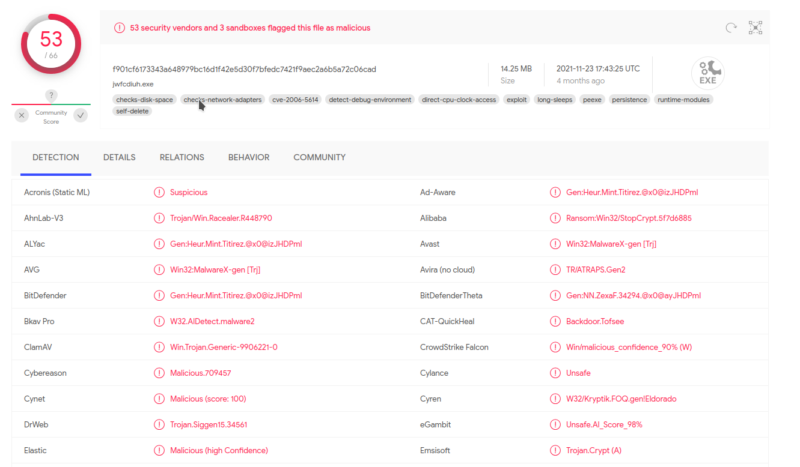

> Shodan Transform

N'ayant aucun résultat retourné avec le nom de domaine *lerepuis.ch*, j'ai décidé d'effectuer cette partie avec *heig-vd.ch*.

Après la première recherche avec Shodan, nous pouvons voir ci-dessous un premier résultat qui semble être une adresse IP liée au nom de domaine *heig-vd.ch*.

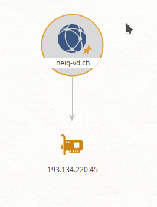

J'ai donc relancé une recherche Shodan avec cette adresse IP et nous pouvons constater:

- 3 noms de domaine sont liées à l'adresse IP `193.134.220.45`: `mas-eddbat.ch`, `mas-mobilite.ch` et `robot15.ch`
- Semble être localisée à Neuchâtel (à la rue du Seyon pour être exact)
- Le fournisseur d'accès Internet (ISP) est SWITCH
- L'IP est liée à l'organisation *Haute Ecole d'Ingenierie*

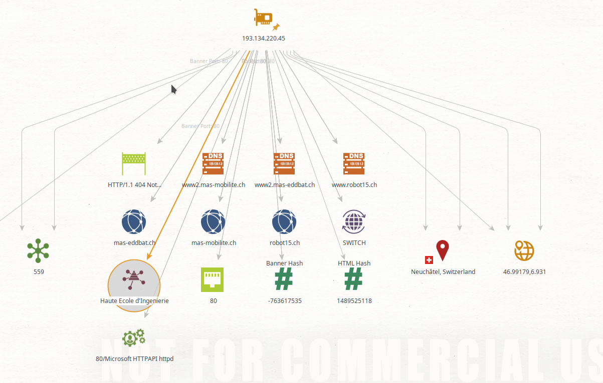

> PassiveTotal

En utilisant le transform PassiveTotal, nous pouvons voir quelques noms de sous-domaines différents (par exemple *mail.lerepuis.ch* ou encore *extranet.lerepuis.ch*). Et sinon, les informations retournées sont les résultats d'une recherche `whois`.

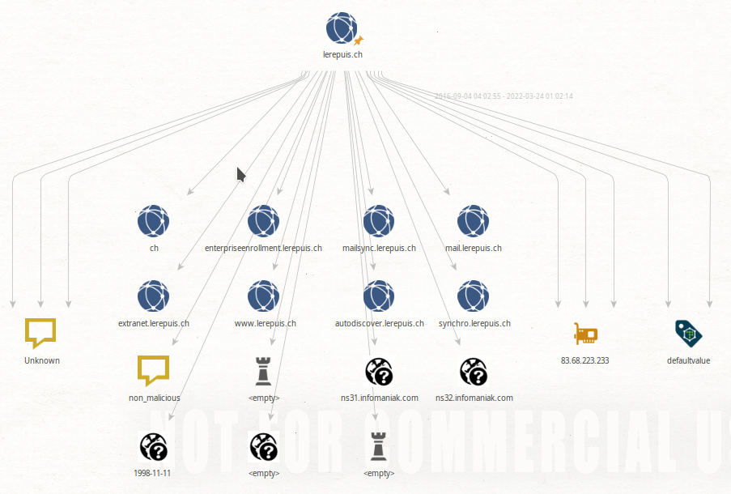

Ainsi, nous pouvons comparer le résultat en effectuant la même commande en local.

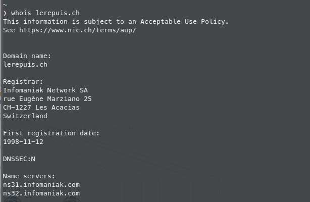

Nous pouvons remarquer que les résultats sont similaires, à part pour la date d'enregistrement du nom de domaine, il y a un jour de différence.

> Question 6 - Suite

| Transformation     | Description                                                  |
| ------------------ | ------------------------------------------------------------ |
| Have I Been Pwned? | Permet de vérifier si des données (adresse e-mail, numéro de téléphone, mot de passe) ont été leaked lors d'attaques |
| OpenCorporates     | Permet de faire des requêtes sur une base de données avec plus de 160 millions d'entreprises |
| Farsight DNSDB     | Permet de faire des requêtes sur une grande base de données DNS |
| FullContact        | Récupère des données telles que adresses e-mail, compte Twitter, domaines, personnes, numéro de téléphone |
| Social Links CE    | Recherche via plusieurs sites les comptes liés à une adresse e-mail |

J'ai testé le transforms Have I Been Pwned ? avec mon adresse personnelle gmail. Nous pouvons voir ci-dessous que mon adresse e-mail a fuité sur le site *123rf.com* lors d'une attaque ciblée.

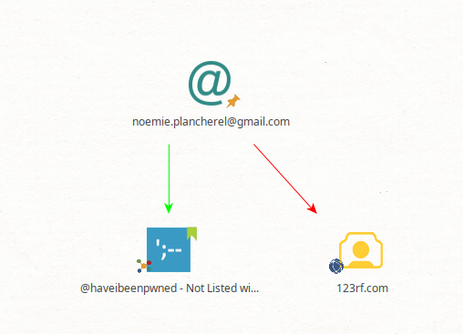

J'ai également effectué une recherche avec Social Links CE avec mon adresse gmail. Cependant, je n'ai trouvé aucun compte lié à mon adresse e-mail mais seulement des documents cloud qui ne sont pas liés à mon adresse e-mail.

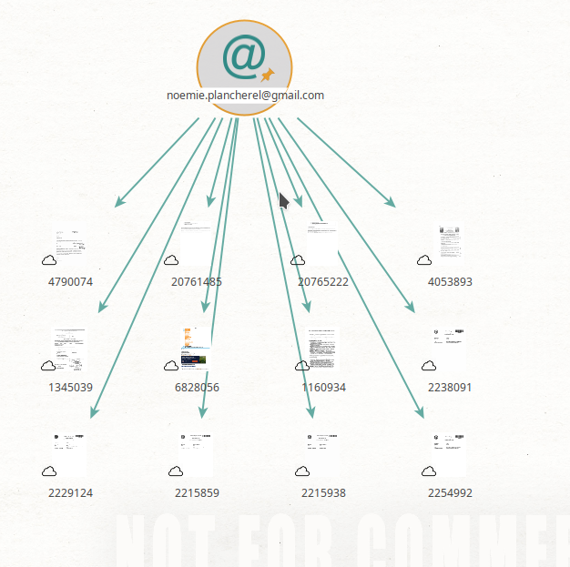

Finalement, j'ai testé Have I Been Pwned ? avec mon adresse de l'école, et on peut constater qu'elle n'a pas fuité. 

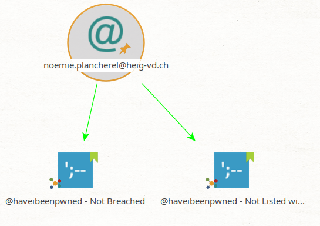
