# Labo découverte Maltego

## Introduction

Maltego est un outil de data mining capable d'explorer une variété de ressources de données open-source et utilise ces données pour créer des graphs permettant d'analyser des éventuelles connexions identifiées entre ces différentes ressources.

Les graphs permettent de faire des connexions entre des informations comme le nom d'une organisation, les adresse email et son structure organisationnelle, des domaines, des documents, etc.

Maltego est écrit en Java, ce qui lui permet de fonctionner sur Windows, Mac et Linux. Il est pré-installé sur Kali.

Dans la pratique, Maltego recherche et parse des grandes quantités d'information à partir de sites publiques et produit un jolie graph pour vous aider à rassembler les pièces du puzzle.

Maltego peut être utilisé en tout moment pendant un audit. Pourtant, si la cible est un domaine, c'est raisonnable de mapper le réseau depuis le début avec Maltego.

## Téléchargement et installation

Il y a plusieurs version de Maltego :

- Maltego XL : version premium pour de grandes quantités de données
- Maltego Classic : version payante qui inclut toutes les "transformations"
- Maltego CE (Community Edition) : Version gratuite avec des "transformations" limitées
- Casefile : pour examiner des liens sur des données offline

Nous allons travailler avec la version gratuite, Maltego CE.

### Installation

- Kali : comme déjà mentionné, Maltego est déjà pré-installé sur Kali. Vous aurez quand-même besoin de vous rendre sur le [site de Maltego](https://www.maltego.com/ce-registration/) pour créer un compte CE. Une fois votre compte crée, vous recevrez une clé qui vous permettra d'utiliser la Community Edition.
- Téléchargement : si vous installez Maltego sur votre machine Windows, Mac ou autre version de Linux, vous pouvez le [télécharger ici](https://www.maltego.com/downloads/). Il vous faudra le [compte CE](https://www.maltego.com/ce-registration/) aussi pour cette version. 

## Transforms

Maltego utilise des API pour connecter à d'autres applications et services. Maltego appelle ces connexions "Transforms" (transformations). 

Vous remarquerez qu'avec la version CE, certaines transformations sont gratuites et d'autres sont payantes. En plus, seul un petit groupe de transformations sont pré-installées. Il faudra donc dans certains cas s'enregistrer sur chaque site pour obtenir un accès à l'API de la transformation et l'activer. Ça dépendra de vos besoins.

Quelques transformations sont gratuites mais elles ne peuvent pas être installées sur la version gratuite de Maltego.

Nous pouvons commencer à travailler utilisant la config de base. La transformation Paterva CTAS CE est pré installée et elle fourni pas mal de fonctionnalités. On va rajouter quelques transforms intéressantes plus tard. 

## Une simple reconnaissance de réseau

Ci-dessous se trouve une capture d'écran du résultat d'une reconnaissance du réseau "heig-vd.ch".  On peut y voir des pages web, des domaines plus ou moins pertinent ainsi que des personnes.

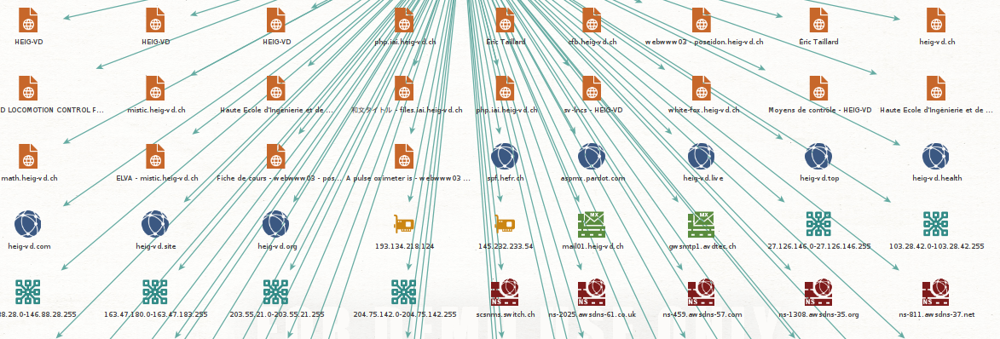

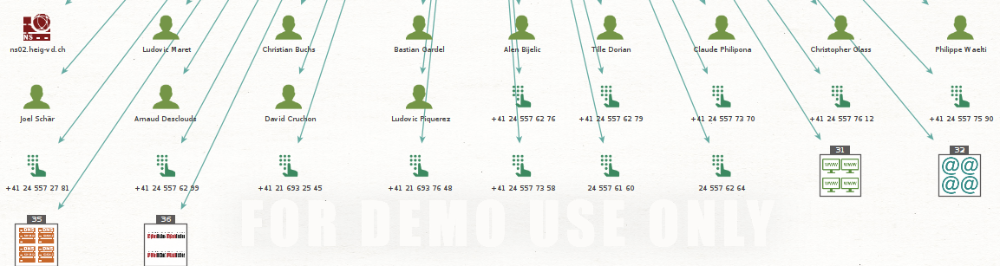

Parmi les personnes identifié par Maltego, il a été choisi d'aller plus loins pour la personne de Bastian Gardel. Nous y trouvons plusieurs adresse email, des numéros de téléphone faux ainsi que des pages web comme Instagram et Facebook ou encore Youtube.

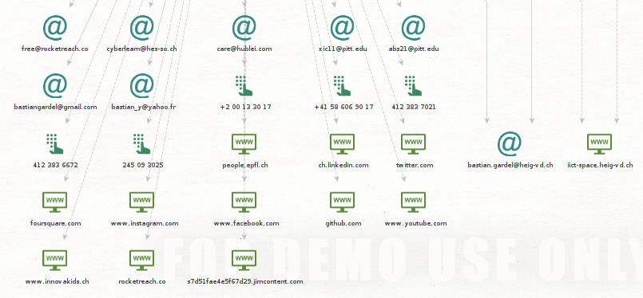

## Recherche d'une identité

Ci-dessous ce trouve les résultats d'une recherche sur Maude Issolah. Les adresses emails ainsi que les numéros de téléphone ne sont pas liée à elle, mais il y a quelques résultats web intéressant.  

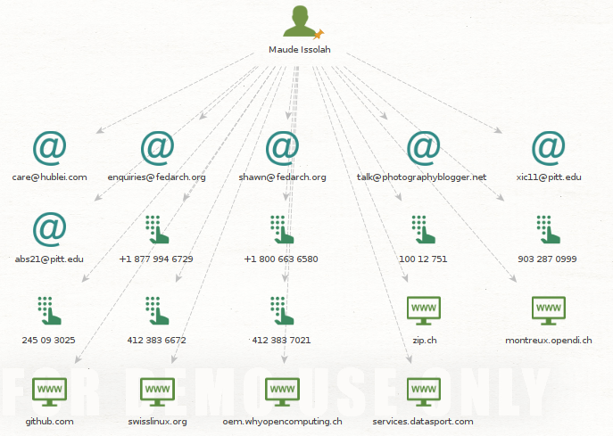

Le liens GitHub retrouve un projet GEN que Maude avait fait. Swisslinux est un forum qu'elle a utilisé et whyopencomputing un PDF (ci-dessous) qu'elle à fait en 2018.

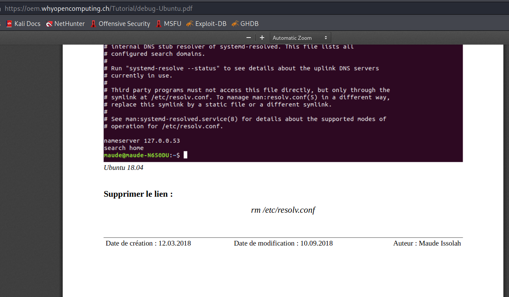

Pour les résultats sur moi même, les adresses emails et les numéros de téléphone sont faux. Il trouve mon facebook et linkedin, mon profil sur le site ggconsultingsarl, une vielle présentation que j'avais faite sur prezi.

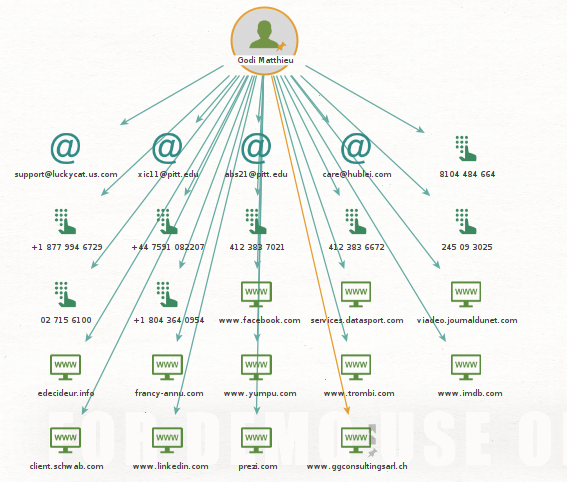

## Recherche d'une adresse email

Pour la recherche sur une adresse email, mon adresse personnelle à été utilisée. Malheureusement, il n'y a que peu de résultat. Seul l'adresse mail d'un ami ressort (pour un raison qui m'est inconnue) qui est d'ailleurs pas exactement juste car ce n'est pas .co mais .com.

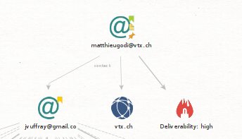

Lors que nous allons plus loin sur l'adresse mail de mon ami, nous obtenons beaucoup plus de résultats. Les adresses emails sont toutes fausses, de même pour les numéros de téléphone. 

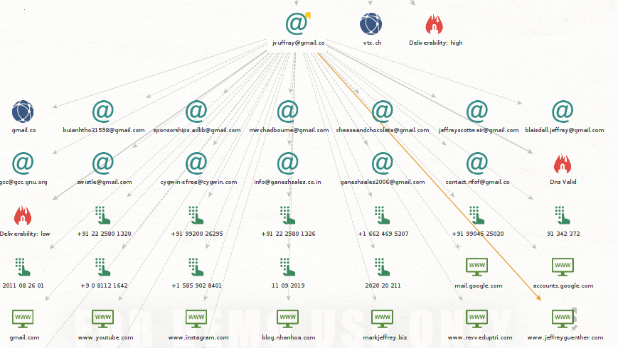

Lors de la recherche avec mon adresse de l'école, il y a pas plus de résultat.

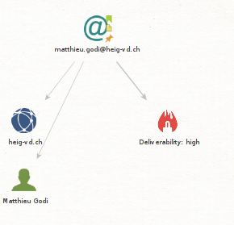

## Installation et utilisation de nouvelles transformations

Pour installer de nouvelles transforms, cliquez sur l'onglet "Transforms" et ensuite sur Transform Hub. Depuis le hub, vous pouvez installer de nouvelles transformations.

Commençons par VirusTotal Public API. VirusTotal peut analyser des fichiers et des URLs pour chercher des malwares. Cela permet, par exemple, de trouver des fichiers/URLs compromis chez une cible. Vous aurez besoin de [créer un compte]( https://www.virustotal.com/gui/join-us) pour avoir accès à une clé vous permettant d'utiliser l'API et donc, la transformation correspondante pour Maltego. Un lien pour trouver votre clé vous sera envoyé dans le même email utilisé pour l'activation du compte.

On va maintenant installer la Shodan Tranform. Shodan.io est un "analyseur d'Internet". Il donne des informations intéressantes (aussi de point de vue de la sécurité) sur des dispositifs connectés, des serveurs et services, etc. Pour comprendre ce que Shodan vous apporte à travers le Transform Maltego et comment ça marche, [vous pouvez lire cet article](http://maltego.blogspot.com/2016/04/abracadabra-its-shodan-time.html). Vous aurez besoin de [créer un compte](https://account.shodan.io/register) pour utiliser la transformation.

PassiveTotal est une plateforme de recherche de menaces. Le but est de contribuer à analyser la sécurité de systèmes pour prévenir les attaques avant qu'elles n 'arrivent. Pour activer cette transformation, il faut commencer par la [création d'un compte](https://community.riskiq.com/registration). Vous accédez ensuite à votre espace utilisateur (account) et révélez les valeurs cachées dans API ACCESS. Attention, la transformation vous demande un user et une clé (key). Ces deux valeurs correspondent respectivement à votre adresse email et à la valeur identifiée comme "secret" sur votre compte riskiq. Pour plus d'information sur cette transformation, ce référer à [cet article](https://blog.passivetotal.org/brand-new-maltego-transforms-and-code/).

Vous pouvez chercher vous même des informations sur d'autres transformations disponibles.

Procédez maintenant à relancer les recherches que vous avez déjà effectuées, mais utilisant exclusivement les transformations que vous venez d'installer. Est-ce que vous arrivez à trouver d'autres informations ? N'oubliez pas votre capture et commentaires.

Virus Total nous trouve beaucoup d'information sur le réseau "heig-vd.ch".

Shodan ne trouve pas grand chose.

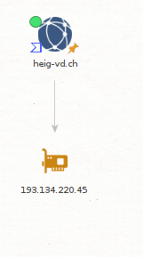

Passive Total trouve quelques informations mais rien d'extraordinaire.

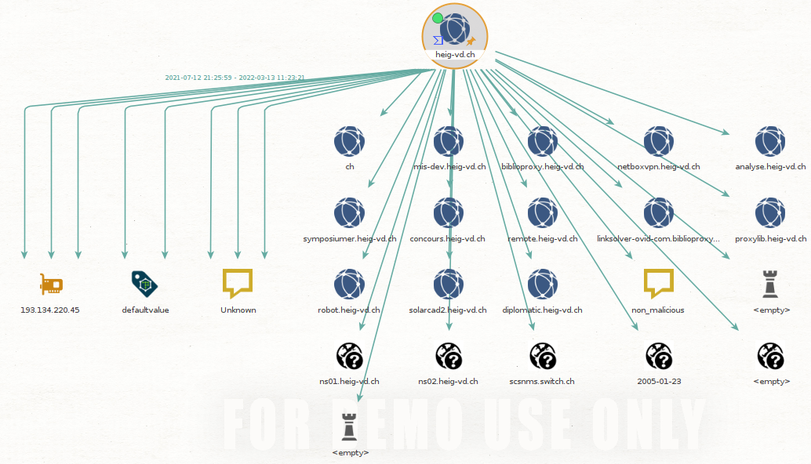

# Livrable

Captures d'écran et commentaires en format PDF ou directement sur le README.md

Le rendu se fait à travers un "pull request". 

# Echéance

Le 14 avril 2022 à 10h25
