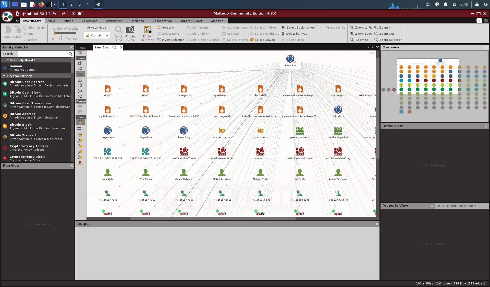
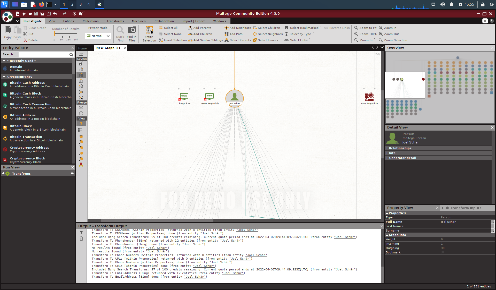
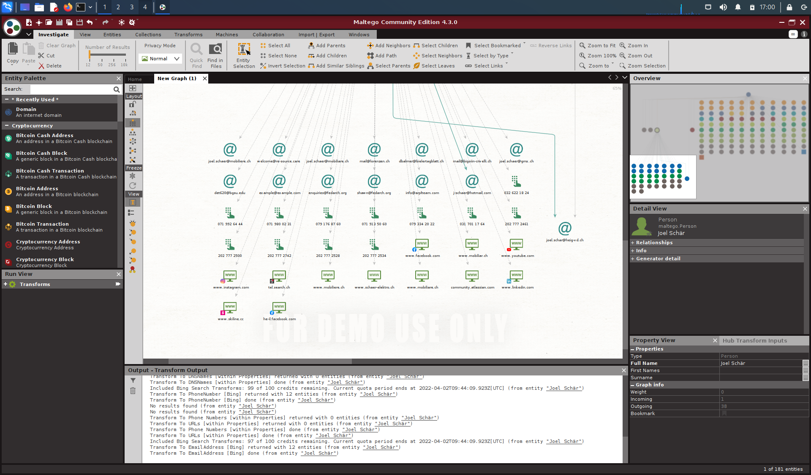
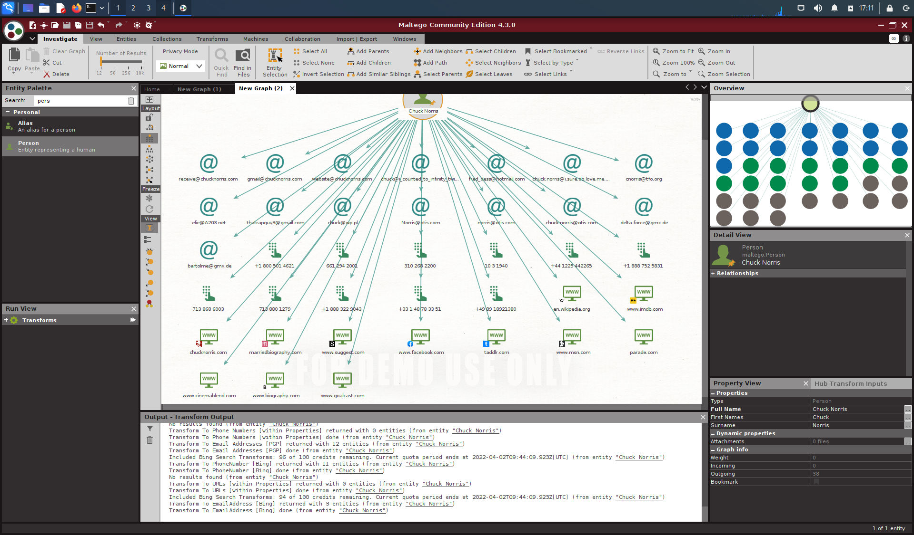
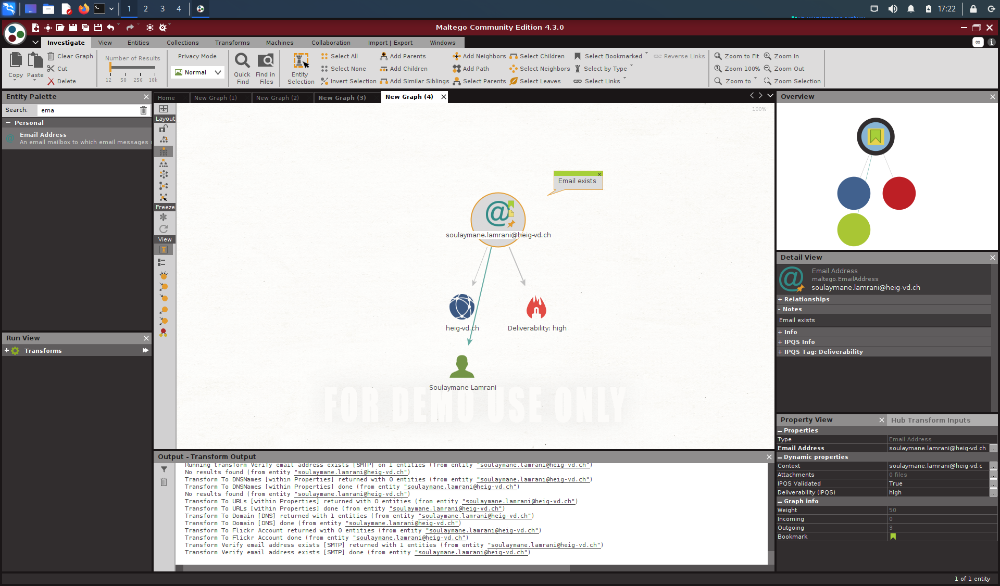
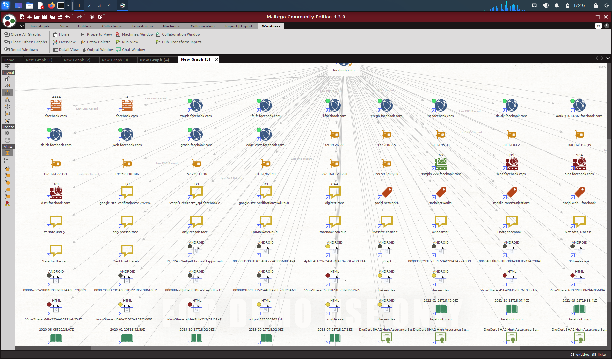
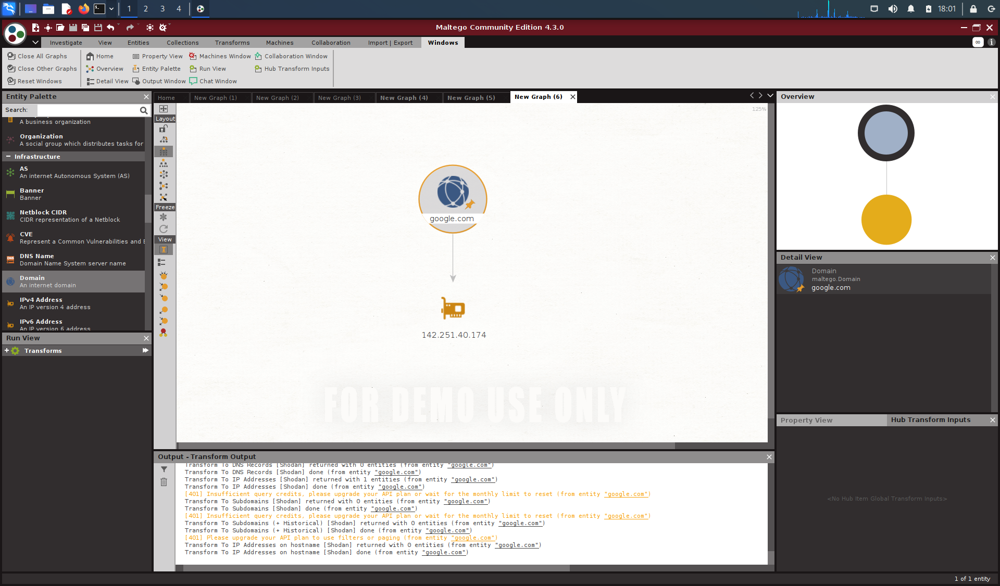
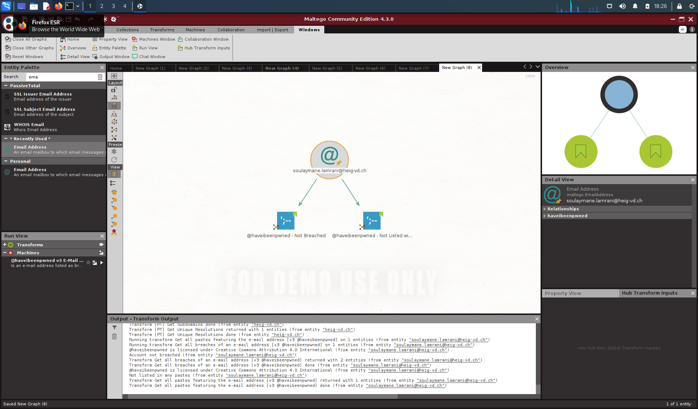

# SEN - Labo 1

Comme le labo s'effectue sur VirtualBox (ptite VM Kali), les screenshots sont de
l'entier de l'écran, donc pas très précis, mais bon, on n'est pas à ça prêt.

## Une simple reconnaissance de réseau

> Qu'est-ce que vous trouvez pour votre cas ? Faites des captures d'écran pour
> votre rendu et ajoutez vos commentaires !



Grosso modo la même chose que sur l'image de démonstration de la donnée du labo.
Je remarque des noms de personnes qui auraient, selon mes souvenirs, terminé
l'école.

> De votre côté, sélectionnez une identité trouvée pour votre domaine et
> exécutez vos transformations. N'oubliez pas de faire une capture et commenter.



J'ai choisi Joel Schär parce qu'il me semble que je vois qui c'est si ma mémoire
est bonne.



Et il en a, des informations tout plein à disposition:

- des adresses e-mails qui ne font pas toujours sens (est-ce qu'il s'appelle
  vraiment shawn ?)
- des numéros de téléphones (sont-ils tous les siens ? Ça en fait, des
  portables)
- des sites web tel qu'Instagram ou YouTube. Probablement ses comptes… ou pas ?

## Recherche d'identité

> Faites quelques recherches, avec des noms que vous connaissez (vous-même
> y-compris). Est-ce que vous arrivez à trouver des adresses email associées ?
> N'oubliez pas vos captures et commentaires.



Comme j'suis un malade, j'ai choisi Chuck Norris. P't'être qu'il viendra faire
un coucou en brisant mon mur, ou ma co, ou bien même directement à l'école
(parce que personne ne tape Chuck Norris).

Et effectivement, tout plein de numéros de téléphone, d'adresses e-mails, y a même [chucknorris.com](chucknorris.com).

Parmi les adresses e-mail, il a *thetrapguy3@gmail.com*, mais je ne suis pas sûr
du type de trap et si c'est vraiment le Chuck national.

## Recherche d'une adresse email

> Réalisez des recherches avec quelques adresses que vous connaissez, de
> préférence liées à une organisation. Est-ce que ça vous permet de retrouver
> des liens intéressants avec l'organisation ? Qu'avez-vous retrouvé en plus ?
> Accompagnez vos réponses avec des captures d'écran et commentaires.



Je n'avais pas vraiment d'idée pour celui-ci, n'ayant pas de proches direct faisant partie d'une organisation (soit des amis qui ont déjà fini l'école, mais dont je ne connais pas nécessairement la nouvelle adresse e-mail professionnelle, soit des gens à la retraite (et gmail, ça compte pas)).

Donc voici mon adresse, qui semble vraisemblablement exister, mais qui ne donne pas vraiment d'informations en plus…

## Installation et utilisation de nouvelles transformations

### Virus Total



Je ne sais trop quoi dire, si ce n'est que [facebook.com](http://www.facebook.com) donne beaucoup de choses, entre les différents sites et services de Facebook, des adresses IP, des certificats et d'autres choses (y a  même un apk dans le tas genre en bas à droite du milieu).

### Shodan

Bon bah, le [blog](https://maltego.blogspot.com/2016/04/abracadabra-its-shodan-time.html) a été supprimé, donc pas de lecture possible…😔



Ok, donc nous voilà avec une adresse IP.

```
% IANA WHOIS server
% for more information on IANA, visit http://www.iana.org
% This query returned 1 object

refer:        whois.arin.net

inetnum:      142.0.0.0 - 142.255.255.255
organisation: Administered by ARIN
status:       LEGACY

whois:        whois.arin.net

changed:      1993-05
source:       IANA

# whois.arin.net

NetRange:       142.250.0.0 - 142.251.255.255
CIDR:           142.250.0.0/15
NetName:        GOOGLE
NetHandle:      NET-142-250-0-0-1
Parent:         NET142 (NET-142-0-0-0-0)
NetType:        Direct Allocation
OriginAS:       AS15169
Organization:   Google LLC (GOGL)
RegDate:        2012-05-24
Updated:        2012-05-24
Ref:            https://rdap.arin.net/registry/ip/142.250.0.0


OrgName:        Google LLC
OrgId:          GOGL
Address:        1600 Amphitheatre Parkway
City:           Mountain View
StateProv:      CA
PostalCode:     94043
Country:        US
RegDate:        2000-03-30
Updated:        2019-10-31
Comment:        Please note that the recommended way to file abuse complaints are located in the following links. 
Comment:        
Comment:        To report abuse and illegal activity: https://www.google.com/contact/
Comment:        
Comment:        For legal requests: http://support.google.com/legal 
Comment:        
Comment:        Regards, 
Comment:        The Google Team
Ref:            https://rdap.arin.net/registry/entity/GOGL


OrgAbuseHandle: ABUSE5250-ARIN
OrgAbuseName:   Abuse
OrgAbusePhone:  +1-650-253-0000 
OrgAbuseEmail:  network-abuse@google.com
OrgAbuseRef:    https://rdap.arin.net/registry/entity/ABUSE5250-ARIN

OrgTechHandle: ZG39-ARIN
OrgTechName:   Google LLC
OrgTechPhone:  +1-650-253-0000 
OrgTechEmail:  arin-contact@google.com
OrgTechRef:    https://rdap.arin.net/registry/entity/ZG39-ARIN
```

Le ptit `whois` qui semble bien montrer que ça appartient à Google.

### PassiveTotal


Je ne sais pas trop quoi décrire de cette image, si ce n'est de surtout voir des
URLs, une tour d'échec et une bulle *suspicious* (dommage, un meme raté).

## Et maintenant ?

Euh… bonne question. Que faire maintenant ? *Have I Been Pwned* a l'air cool.

<table>
  <tr>
    <th>Extension</th>
    <th>Ce qu'elle fait</th>
  </tr>
  <tr>
    <td>Have I Been Pwned</td>
    <td>Vérifie si une adresse e-mail a son mot de passe disponible sur le Web quelque par</td>
  </tr>
  <tr>
    <td>Social Links CE</td>
    <td>J'imagine que ça permet de mieux cibler les liens sociaux d'une personne. Et c'est noté que c'est <i>Russia Based</i></td>
  </tr>
</table>

J'voulais aussi tester Google Programmable Search Engine, mais y a des erreurs à l'output, donc ripperoni.

### Have I Been Pwned



Cool de voir que mon adresse va bien. 😃

### SocialLink


Toutes ces personnes ont beau avoir un prénom à consonnance arabe et le même nom
de famille que moi, je n'en connais aucune. Mais on peut voir que pour ceux que
j'ai vérifié, ils viennent des UK.

## Conclusion

Maltego semble être un outils très puissant pour retrouver des informations qui
ne sont pas directement disponibles depuis un clique sur le navigateur. Un peu à
la ghidra pour décompiler un binaire en code C, il fait un excellent travail de
récupération de données (certes, peut-être pas toujours pertinentes, mais c'est
à nous de trier) et on peut s'amuser à faire des recherches sympathoches.
Évidemment, à garder loin de mains pas gentilles.

(Et c'est marqué à rendre pour le 14 avril, donc pas trop taper pour ce retard,
pwetty pwease)
