# SEN 2022

## Labo 1 - Maltego

Auteur: Maude Issolah

Date: 31.03.2022

### Recherche d'un domaine

Résultat de la recherche pour le domaine vmcv.ch

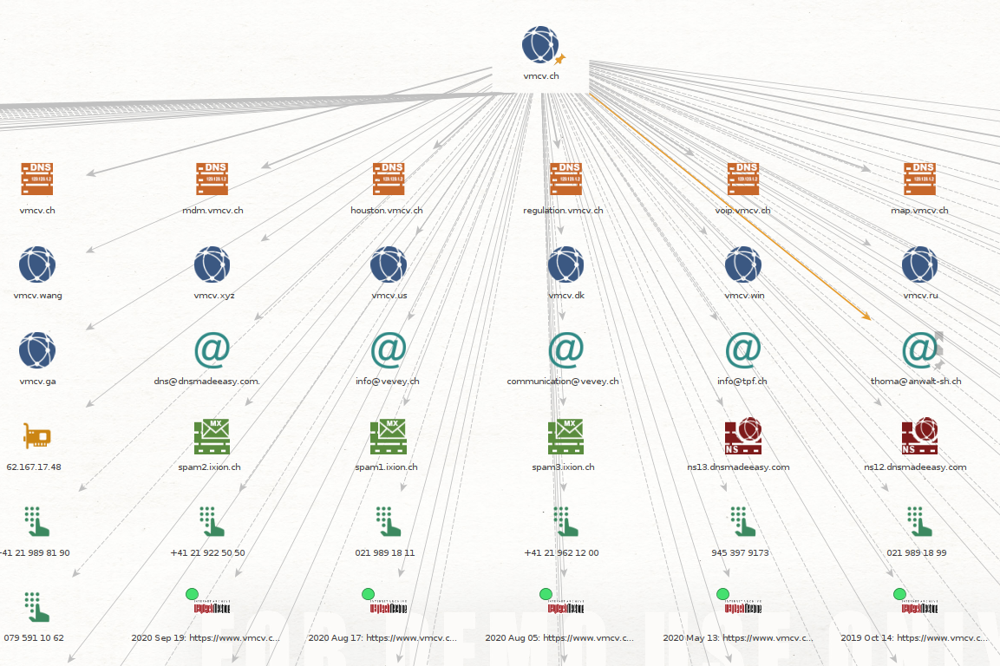

Cette recherche nous retourne la liste des noms de domaine associés à `vmcv.ch` ainsi que des adresses mails, numéro de téléphones, et liens archivés.

Dans les adresses mails nous trouvons les partenaires de VMCV, qui sont facilement trouvables sur le site web. Par contre, nous trouvons aussi la société iXion (spam.ixion.ch) qui gère une partie de leur infrastructure IT et qui n'est pas directement listée sur leur site.

### Recherche d'une identité

La recherche a été faite sur moi-même pour pouvoir analyser précisément les résultats. Cela m'a aussi permis de découvrir des entrées d'annuaires non désirées que je n'avait pas trouvé avec une recherche Google (mais que j'aurai pu trouver sur DuckDuckGo).

En lançant plusieurs fois cette même recherche j'ai remarqué que les résultats n'étaient pas exactement les mêmes.

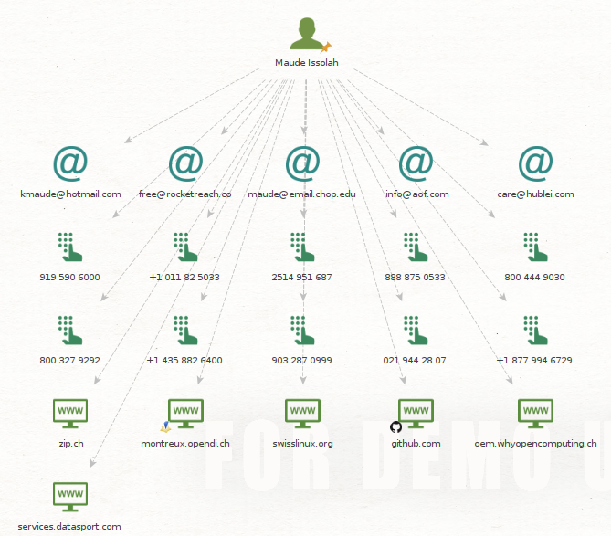

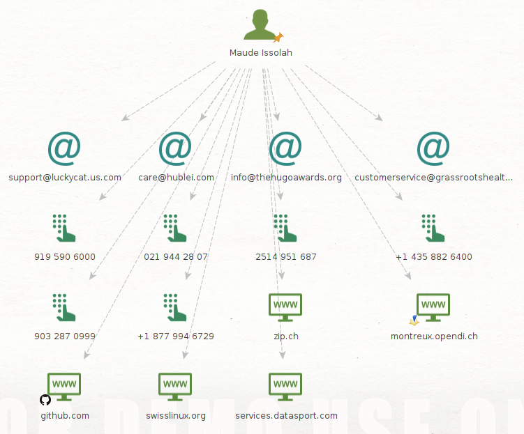

Sur ces résultats, seules six valeurs sont pertinentes:

**Site web**

- `zip.ch` et `opendi.ch` sont des annuaires en ligne. Ces liens devraient disparaitre, car j'ai fait supprimer mes données dès que je les ai trouvées.

  *Maltego* a trouvé sur `github` un projet de groupe HEIG sur lequel il y a nos noms, mais n'a pas réussi a faire le lien avec mon compte perso.

  Il a aussi trouvé le résultat de ma dernière participation aux 20km de Lausanne.

  Les deux dernier sites son en lien avec le stage que j'avait fait durant mon apprentissage. Etonnamment le lien `oem.whyopnecomputing` ne sort pas a chaque fois, alors qu'il y a mon nom dans le document.

- **Adresses mail**

  Je ne connait aucun de ces nom de domaine.

- **Numéro de téléphones**

  Mon numéro de téléphone fixe est dans la liste (avec les entrées des annuaires ça n'était pas compliqué à trouver), les autres me sont inconnus.

  

  Après avoir fait plusieurs recherches sur d'autres personnes de mon entourage, je trouve que Maltego n'est pas forcement l'outil le plus adapté pour la recherche de personne, car il ne fait pas la différence entre les homonymes. Utiliser les possibilité de recherche Google avec différents mots clé est bien plus efficace.

  

  ### Recherche d'une adresse mail

  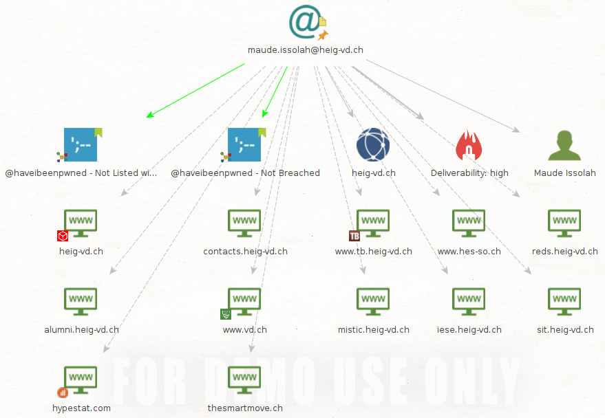

  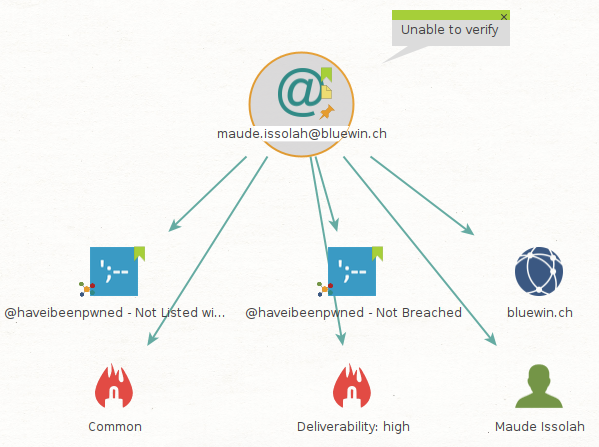

  Globalement, Maltego trouve la personne et le domaine associé à l'adresse.

  

  ### Utilisation de nouvelles transformations

  #### VirusTotal 
  
  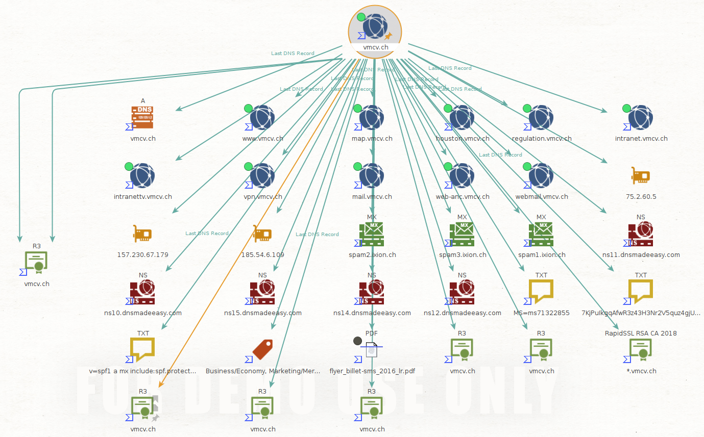
  
  VirusTotal trouve en plus de la recherche précédente des certificats.
  
  Le résultat pour VMCV n'étant pas très intéressant, j'ai fait une recherche sur le site de la commune de Montreux.
  
  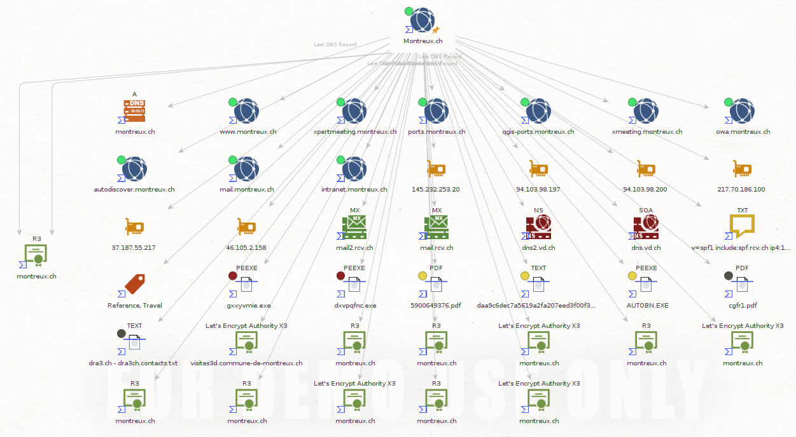
  
  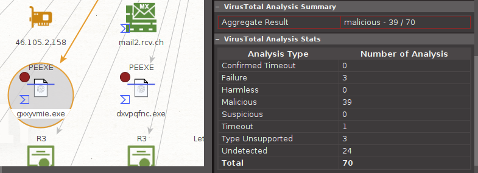
  
  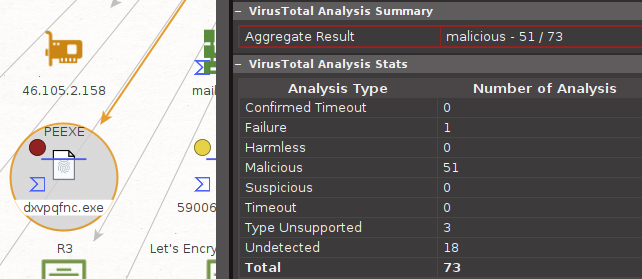
  
  On trouve des exécutables douteux.
  
  
  
  #### Shodan 
  
  Shodan donne le même type de résultat sur tous les nom de domaine que j'ai testé, à savoir une adresse ip.
  
  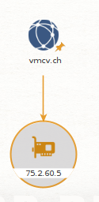
  
  
  
  #### PassiveTotal 
  
  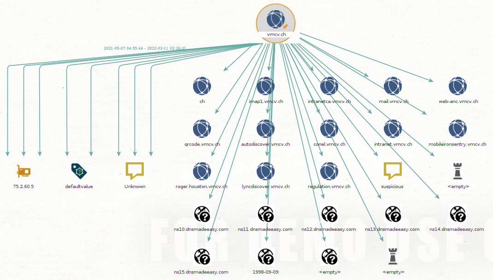
  
  
  
  ### Ajout de transformation
  
  Transformation ajoutées: IPinfo, Have I Been Pwned, NIST NVD.
  
  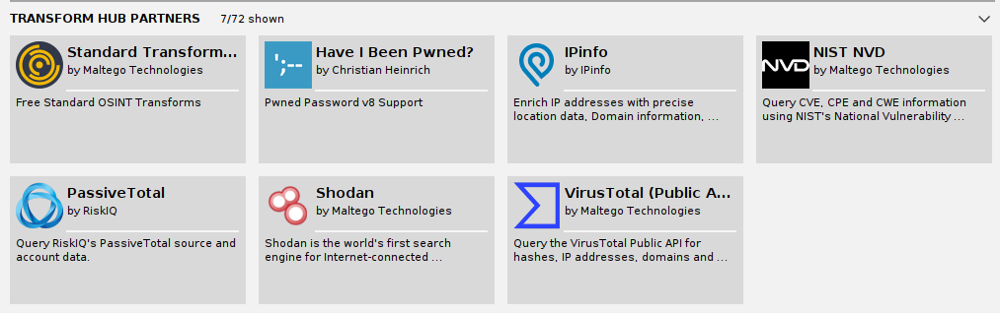
  
  
  
  **IPinfo**
  
  IPinfo nous donne des informations de localisation des IP.
  
  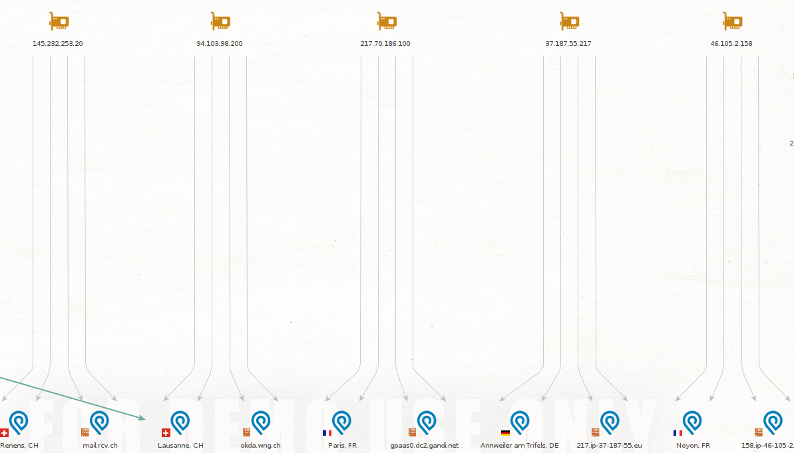

Have I Been Pwned cherche dans des listes pour vérifier si l'email donné a été leaké.

On voit son affichage dans les captures d'emails.

A force d'appliquer des transformations sur le même graph, ce dernier devient difficile à gérer. Il peut être plus pratique d'ouvrir de nouvelles pages.

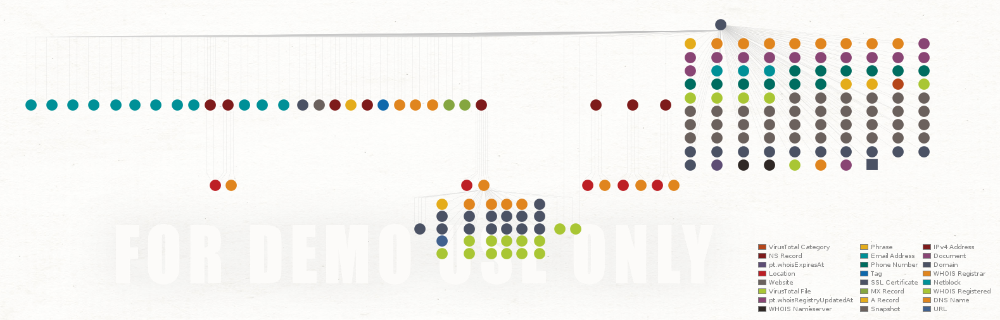
