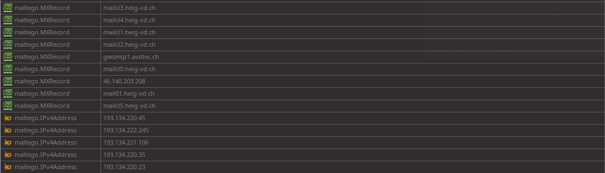

Lucas Gianinetti - 31.03.2022
___
# Labo Découverte Maltego

## Une simple reconnaissance de réseau

J'ai fait la reconnaissance sur le domain **ascenseurs.lsm.swiss**, les dates utilisées pour lancer les transformations sont les suivantes :
* Début: Date par défaut -  01.01.2010
* Fin: Date de réalisation du labo - 31.03.2022

Il ressort différents types de documents de la recherche :
* Des sites web
  
* Des snapshots
  
* Des numéros de téléphone
  
* Une adresse email
  
* Des noms de domaine
  
* Des documents
  
* Des DNS
  

Il y a beaucoup d'informations dont un certain nombre sont erronées. Par exemple parmi les sites web il n'y a que le site **ascenseurs.lsm.swiss** qui correspond au nom de domaine recherché. Les noms de domaine aussi sont faux, comme le nom de domaine recherché comprenait un "mot générique" (ascenseurs) cela a donné beaucoup de faux positifs.

___
Reconnaissance sur le domaine **heig-vd.ch**

On voit qu'il y a directement beaucoup plus d'informations disponibles, dont par exemple des personnes liées à la heig ce qu'il n'y avait pas pour la recherche ci-dessus

## Recherche d'une identité

On peut voir que me concernant, Maltego a réussi à trouver des repos gits auxquels j'ai contribué ainsi que mon compte facebook. Le reste des informations sont soit complétement fausses tels que les adresses et mails et la majorité des sites. Soit des faux positifs comme un homonyme qui a un compte twitter.com/LucasGianinetti2 où encore une personne dont le nom me ressemble fortement *facebook.com/lucasgiannetti

## Recherche d'une adresse email

J'ai recherché l'adresse email heig de Nicolas. On peut voir qu'elle a directement été associée avec le domaine heig-vd.ch ainsi qu'à son identité

## Virus total

J'ai appliqué la transformation sur le domaine **heig-vd.ch**

On retrouve entre autres des certificats TLS:

Des adresses IPs

Des phrases

## Shodan
J'ai run toutes les transormations de Shodan sur le domaine **heig-vd.ch**.
Une adresse IP a été trouvée :

En effectuant un `whois 193.134.220.45` on voit bien que l'adresse ip est liée à la heig et aussi à un certain Fabrice Demierre

## PassiveTotal

Résultat sur le domaine **heig-vd.ch**, pas d'informations supplémentaires très intéressantes

## Farsight DNSB

Collections passives de données DNS

En faisant la transformation sur le domaine heig-vd.ch on peut voir qu'il trouve plus de DNS, serveur mail et adresses IPs

## Have I Been Pwned ?

Regarde si une adresse email a été compromise / Comparaison avec des DB d'emails compromises connues

On peut voir que mon mail de l'heig ne fait pas parti des listes d'emails compromises

## Dataprovider

## FullContact
Trouve toutes les informations de contacts, tel que num de téléphone, adresse, page web d'infos, compte twitter

Pour heig-vd.ch

## Conclusion

Si j'effectue toutes les transformations (de base + les transformations ajoutées) sur le domaine de la heig-vd on peut voir que les informations sont nombreuses et que le graphe devient difficile à lire

Mais en sélectionnait l'affiche par liste et en triant les informations par types nous arrivons à trouver notre chemin.

L'outil est très puissant et la combinaison des différentes transformations permet d'avoir une vue d'ensemble de l'organistion recherchée.

