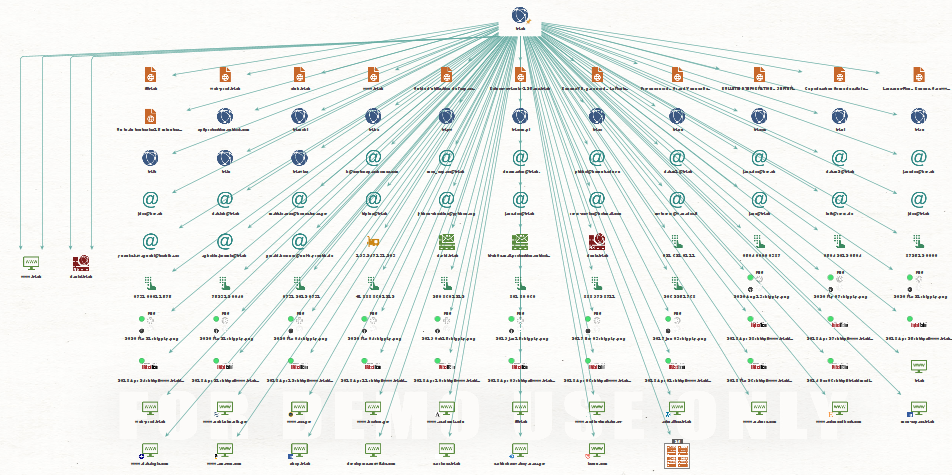
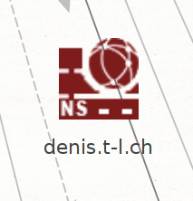

# Labo Maltego

Auteur: Besseau Léonard

___

# Reconnaissance de réseau

## Domaine

J'ai choisi d'effectuer la reconnaissance sur le domaine des [Transports Lausannois](https://t-l.ch/) où j'ai effectué mon audit de sécurité du cours d'AST.

La vue globale n'est pas très utile, car de nombreuse informations sont des erreurs.

On y trouve néanmoins des liens vers des sous domaines:

Exemple d'erreur:

On peut voir un lien entre le domaine et l'adresse email de la chambre des représentants du Texas, ce qui n'a pas beaucoup de sens.

On trouve également beaucoup adresse email de test (john doe)

On trouve également des informations provenant de la page accueil du site comme le numéro de téléphone de l'entreprise:

On trouve également des liens vers les anciennes versions du site avec wayback machine:

Un élément intéressant pour un attaquant est la liste des sous domaines DNS:

Il est également étonnant de voir des NS record avec des noms de personne:

## Recherche identité

Pour la recherche d'identité, j'ai recherché moi même, et même si aucun des numéros de téléphone ou adresses email ne sont à moi, on trouve néanmoins mon Github ou mon Linkedin. On trouve également des résultats de course de ski auquel j'ai participé.

## Recherche d'une adresse email

J'ai effectué la recherche sur mon adresse email de l'école.

On peut voir que le lien avec l'identité recherché auparavant a été fait et que la recherche s'est également étendu à la HEIG. L'existence de adresse email a été confirmé et l'IPQS n'a pas détecté de problème sur l'email.

## Installation et utilisation de nouvelles transformations

### VirusTotal

La transformation a extrait les certificats TLS mais également l'adresse IP du serveur web.

## Shodan

N'a pas pu être testé dû à des erreurs API.

## Passive Total

On obtient peu de nouvelles informations intéressantes. Malgré mes recherches, je n'ai pas réussi à savoir ce que le suspicious signifie. On y trouve des domaines différents qui n'ont pas l'air d'avoir de lien direct avec le domaine recherché.

## Autres extensions

## Dataprovider

L'extension n'existe plus.

## Wayback machine

Permet d'accéder à des versions précédentes du site web.

## SSL Certificate Transform

Récupère des informations sur les certificats SSL/TLS et détecte des éventuels problèmes (Certificats autosignés, compromis, etc.) 

## Farsight DNSDB

Permet d'obtenir d'information en lien avec les informations DNS ainsi que les noms de domaine, IP et NX.

## Have I been pwned

Extension pour vérifier si une adresse email fait partie de certaines leaks de mot de passe. On peut voir par exemple que mon adresse de l'école n'est dans aucun leak connu.

## Social Link

Extension pour effectuer des recherches plus poussés sur les réseaux sociaux ou professionnels. La recherche si dessous n'a pas trouvé d'information sur moi, mais les informations sur les personnes connectés sont très complètes (Adresses, date de naissance, numéro de téléphone)

