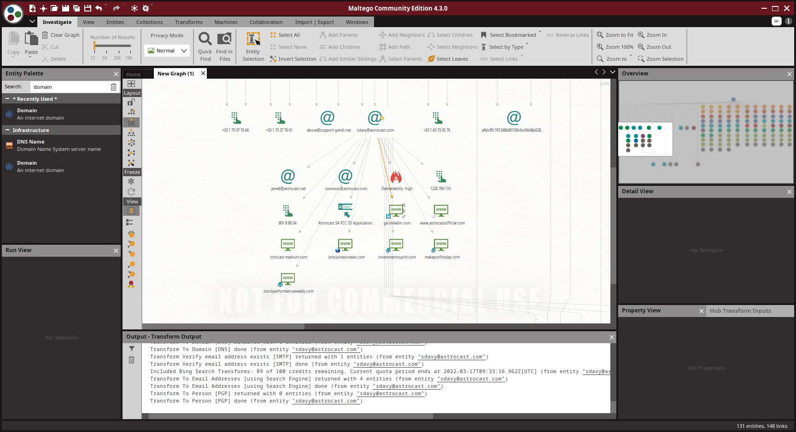

## Une simple reconnaissance de réseau

Voici le resultat du premier scan effectué sur le site astrocast.com

On voit une serie de sous-domaines associées à astrocast.com puis des domaines associée avec un TLD different.

On a aussi trouvé quelques addresses mail mais pas beaucoup ne sont directement liées à astrocast.com. Il y a des numero de téléphone, des snapshot WebArchive et des lien vers des sites qu ise trouvent sur le site principal.

Comme l'entité trouvée par Maltego n'est pas une personne en elle même j'ai decider de lancer les transformations sur l'addresse mail "sdavy@astrocast.com"

Les transformations ont trouvée d'autres emails ainsi qu'une application FCC faite par astrocast. Il y a aussi quelques liens personels.

## Recherche d'une identité

J'ai effectuer la recherche sur moi même.

Je n'ai pas trouvé d'email qui m'appartiennent. Seul mon Github ainsi que ricardo était correct.

## Recherche d'une adresse email

J'ai effectuer la recherche sur un email personel qui avait été trouver sur le site de astrocast.com dans le but de retomber sur la société.

Maltego n'a pas retouver de lien direct avec la société excepté via LinkedIn. On trouve aussi quelques comptes de reseaux sociaux liés à la personne.

J'ai ensuite effectuer une autre recherche sur une personne de chez Pix4D.

On arrive a retrouver la société grace au domaine de l'email mais nous n'avons pas plus d'informations interessantes.

## Installation et utilisation de nouvelles transformations

J'ai effectuer les nouvelles transfromation sur le site de astrocast.com

On peut voir que l'ont trouve des IP grace a Shodan Ainsi que des fichiers qu iont été scanné par VirusTotal.

Si on effectue une recherche sur une des ip, on trouve qu'elle appartient à Infomaniak

## Et maintenant ?

J'ai installé la transformation "Have I've been pwned" et lancer la recherche sur un email trouvé.

On peut voir qu'il y a un hit avec un leak de LinkedIn.